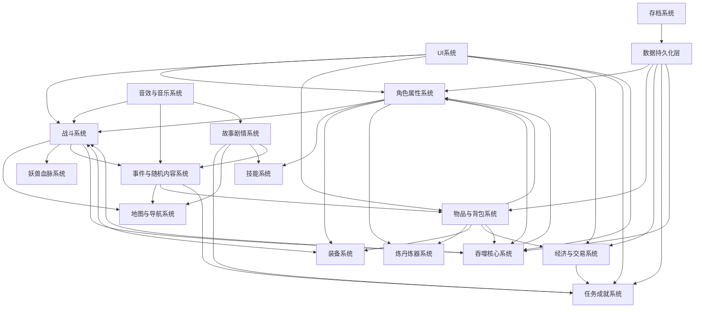

# 整体系统设计

## 系统概述
本修仙游戏采用模块化架构设计，包含多个相互关联又相对独立的系统模块。各模块协同工作，共同构建完整的修仙体验。系统设计遵循高内聚低耦合原则，便于开发、测试和后续扩展。

## 模块分级
根据功能重要性和开发优先级，将系统模块分为以下两类：

### 核心模块（必须实现）
| 模块名称 | 功能简介 |
|---------|---------|
| 角色属性系统 | 管理玩家角色的基本属性、境界、经验等核心数据 |
| 战斗系统 | 实现战斗逻辑、技能释放、伤害计算等核心战斗机制 |
| 物品与背包系统 | 管理玩家获取、使用、存储各类物品 |
| 地图与导航系统 | 实现游戏世界的地图结构、探索机制和导航功能 |
| UI系统 | 提供玩家与游戏交互的界面元素和操作方式，细分为主界面、战斗UI、背包UI等子系统 |
| 经济与交易系统 | 设计游戏内货币体系、商店系统和交易规则 |
| 任务成就系统 | 提供玩家目标指引和成就感反馈 |
| 存档系统 | 实现游戏进度的保存和加载功能 |
| 吞噬核心系统 | 实现吞噬玩法和能力成长，是游戏核心特色机制 |
| 技能系统 | 实现多样化的修仙技能和法术体系，包括技能学习、升级和释放机制 |

### 扩展模块（可选实现）
| 模块名称 | 功能简介 |
|---------|---------|
| 炼丹炼器系统 | 提供丹药炼制和装备打造功能 |
| 妖兽血脉系统 | 设计妖兽捕捉、培养和血脉融合玩法 |
| 事件与随机内容系统 | 生成动态事件和随机内容，增强游戏可玩性 |
| 故事剧情系统 | 提供游戏背景故事和任务剧情，推动游戏进程 |
| 教程与引导系统 | 帮助新玩家熟悉游戏操作和机制 |
| 设置系统 | 允许玩家自定义游戏体验 |
| 音效与音乐系统 | 提供游戏音频体验，包括背景音乐、战斗音效和事件音效 |
| 结局系统 | 设计多结局游戏体验 |
| AI策略系统 | 实现NPC和敌人的智能行为 |
| 元素属性系统 | 设计五行、属性相克等元素系统 |
| 合成配方系统 | 提供物品合成和配方解锁功能 |
| 场景与交互系统 | 设计游戏场景和环境交互 |
| 装备系统 | 提供装备管理和强化功能，直接影响战斗效果 |
| 进化系统 | 设计角色或妖兽的进化机制 |

## 模块功能详细描述

### 核心模块
1. **角色属性系统**：管理玩家的境界、气血、法力、攻击、防御等属性，实现属性成长和境界突破机制。
2. **战斗系统**：实现回合制或即时制战斗逻辑，包括技能释放、伤害计算、状态效果等。直接接收装备系统的属性加成。
3. **物品与背包系统**：管理各类物品的获取、使用、存储和丢弃，包括装备、道具、消耗品等。
4. **地图与导航系统**：构建多层级游戏世界，提供地图探索、迷雾系统、路径寻路和传送机制。响应事件系统触发的地图变化。
5. **UI系统**：设计修仙风格的用户界面，细分为主界面、战斗UI、背包UI等子系统，分别与对应模块交互，提供直观的交互方式。
6. **经济与交易系统**：设计灵石、仙玉等货币体系，实现商店、拍卖行等交易场所和规则。
7. **任务成就系统**：提供主线、支线任务系统，设计成就体系和奖励机制。作为故事剧情和玩家进度的桥梁。
8. **存档系统**：通过数据持久化层实现游戏进度的保存和加载，支持多个存档位。
9. **吞噬核心系统**：作为游戏核心特色机制，实现吞噬玩法和能力成长，包括吞噬妖兽、物品、灵气等获取力量的方式，以及吞噬后的能力融合、变异等特色玩法。
10. **技能系统**：实现多样化的修仙技能和法术体系，包括技能学习、升级和释放机制。与故事剧情系统联动，通过剧情解锁新技能。

### 扩展模块
（各扩展模块的详细描述可参考对应模块文档）

## 模块关系图

## 系统架构设计原则
1. **模块化**：各系统独立开发、测试和维护，降低耦合度
2. **可扩展性**：预留扩展接口，便于后续功能添加
3. **数据驱动**：使用配置表驱动游戏内容，便于平衡和调整
4. **性能优化**：针对各模块设计性能优化策略，确保游戏流畅运行
5. **用户体验优先**：所有系统设计以提升玩家体验为核心目标

