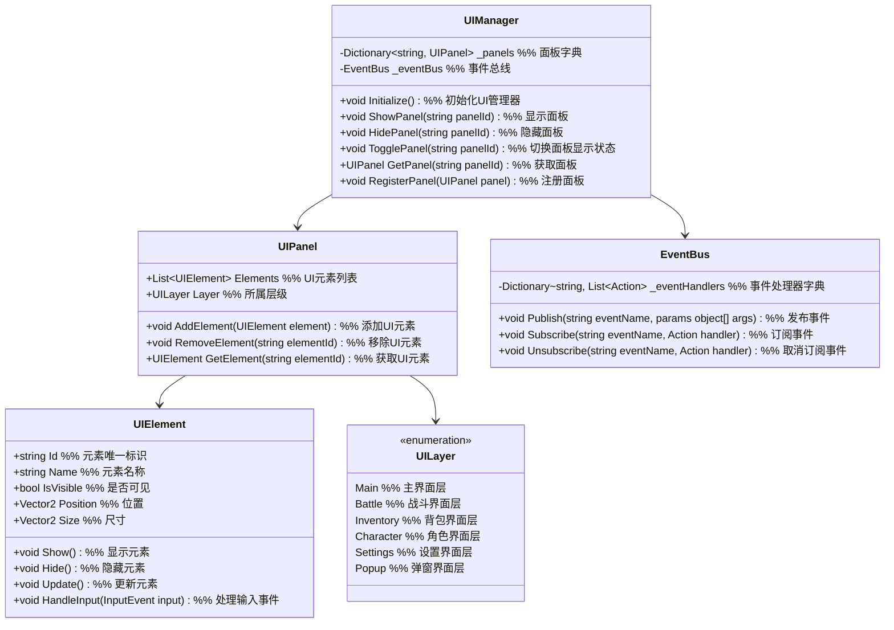

# 一期UI系统设计

## 1. 功能项概述与用例场景

UI系统负责游戏界面的展示和用户交互，是玩家与游戏世界沟通的桥梁。本系统一期实现以下核心功能：

| 功能项         | 描述                                                         | 实际游戏用例场景 |
|----------------|--------------------------------------------------------------|------------------|
| 主界面         | 设计简洁的主界面，显示角色状态、小地图和快捷功能               | **场景1：角色状态查看**<br>玩家随时可以查看当前气血、法力和等级信息<br>**场景2：快捷操作**<br>通过主界面快捷栏快速使用物品和技能 |
| 战斗界面       | 提供直观的战斗操作界面，显示战斗信息和可用操作                 | **场景1：技能释放**<br>战斗中点击技能按钮释放对应技能<br>**场景2：目标选择**<br>点击敌人进行目标锁定，显示敌人生命值和状态 |
| 背包界面       | 设计清晰的背包界面，支持物品查看、使用和整理                   | **场景1：物品使用**<br>打开背包选择药品使用，恢复角色生命值<br>**场景2：装备更换**<br>在背包中选择更好的装备替换当前装备 |

## 2. 系统架构图



### 架构设计用例说明

**为什么使用分层设计？**
- **用例1：界面覆盖** - 确保战斗界面始终显示在主界面之上，弹窗界面显示在最顶层
- **用例2：管理简化** - 按功能将界面分组，便于统一显示和隐藏

**为什么使用事件总线？**
- **用例1：数据同步** - 角色属性变化时，通过事件通知UI更新显示
- **用例2：模块解耦** - UI系统不直接依赖其他系统，通过事件进行通信

### 主要功能流程说明

#### 流程1：界面打开流程

```
场景：玩家点击背包按钮打开背包界面

1. 输入系统 → UIManager
   调用：TogglePanel("InventoryPanel")
   说明：请求打开/关闭背包界面

2. UIManager 内部处理
   - 检查背包界面当前状态
   - 如果已打开：调用 HidePanel("InventoryPanel")
   - 如果未打开：调用 ShowPanel("InventoryPanel")
   - 加载背包数据

3. UIManager → UIPanel
   触发：OnPanelShown("InventoryPanel")
   说明：通知背包面板显示

4. UIPanel 内部处理
   - 设置 IsVisible = true
   - 启用交互
   - 更新界面数据

5. 界面显示完成
   UIPanel → UI系统
   触发：OnPanelReady("InventoryPanel")
   说明：通知系统界面已准备好
```

#### 流程2：数据更新流程

```
场景：角色升级，UI更新等级和属性显示

1. 角色属性系统 → EventBus
   触发：OnLevelUp(newLevel, newAttributes)
   说明：发布等级提升事件

2. EventBus → UIManager
   调用：HandleEvent("OnLevelUp", newLevel, newAttributes)
   说明：转发事件到UI管理器

3. UIManager → UIPanel
   调用：UpdatePanelData("MainPanel", newLevel, newAttributes)
   说明：更新主面板数据

4. UIPanel → UIElement
   调用：UpdateElement("LevelText", newLevel)
   调用：UpdateElement("HpBar", newAttributes.Hp, newAttributes.MaxHp)
   调用：UpdateElement("MpBar", newAttributes.Mp, newAttributes.MaxMp)
   说明：更新各个UI元素

5. UI元素更新完成
   UIElement → UIPanel
   触发：OnElementUpdated(elementId)
   说明：通知面板元素已更新
```

## 3. 数据结构设计

### 3.1 UI层级枚举

```csharp
public enum UILayer
{
    // 主界面层
    Main,
    // 战斗界面层
    Battle,
    // 背包界面层
    Inventory,
    // 角色界面层
    Character,
    // 设置界面层
    Settings,
    // 弹窗界面层
    Popup
}
```

### 3.2 UI元素结构

```csharp
public class UIElement
{
    public string Id { get; set; }
    public string Name { get; set; }
    public bool IsVisible { get; set; }
    public Vector2 Position { get; set; }
    public Vector2 Size { get; set; }
    public object DataContext { get; set; }

    public virtual void Show()
    {
        IsVisible = true;
    }

    public virtual void Hide()
    {
        IsVisible = false;
    }

    public virtual void Update()
    {
        // 更新逻辑
    }

    public virtual void HandleInput(InputEvent input)
    {
        // 输入处理逻辑
    }
}
```

### 3.3 UI面板结构

```csharp
public class UIPanel
{
    public string Id { get; set; }
    public string Name { get; set; }
    public UILayer Layer { get; set; }
    public List<UIElement> Elements { get; set; }
    public bool IsVisible { get; set; }

    public UIPanel()
    {
        Elements = new List<UIElement>();
    }

    public void AddElement(UIElement element)
    {
        Elements.Add(element);
    }

    public void RemoveElement(string elementId)
    {
        var element = Elements.FirstOrDefault(e => e.Id == elementId);
        if (element != null)
        {
            Elements.Remove(element);
        }
    }

    public UIElement GetElement(string elementId)
    {
        return Elements.FirstOrDefault(e => e.Id == elementId);
    }

    // 其他方法...
}
```

## 4. 接口设计与用例场景

### 4.1 UI管理器接口

```csharp
public interface IUIManager
{
    // 初始化UI系统
    void Initialize();

    // 显示面板
    void ShowPanel(string panelId);

    // 隐藏面板
    void HidePanel(string panelId);

    // 切换面板显示状态
    void TogglePanel(string panelId);

    // 获取面板
    UIPanel GetPanel(string panelId);

    // 注册面板
    void RegisterPanel(UIPanel panel);

    // 注销面板
    void UnregisterPanel(string panelId);

    // 更新面板数据
    void UpdatePanelData(string panelId, params object[] data);
}
```

### 4.2 事件总线接口

```csharp
public interface IEventBus
{
    // 发布事件
    void Publish(string eventName, params object[] args);

    // 订阅事件
    void Subscribe(string eventName, Action handler);

    // 取消订阅
    void Unsubscribe(string eventName, Action handler);

    // 订阅带参数的事件
    void Subscribe<T>(string eventName, Action<T> handler);

    // 取消订阅带参数的事件
    void Unsubscribe<T>(string eventName, Action<T> handler);
}
```

## 5. 实现细节

### 5.1 配置表设计

为了提高系统的灵活性和可维护性，一期实现以下配置表：

#### 5.1.1 UI面板配置表 (UIPanelConfig.csv)

| 字段名        | 类型   | 描述                          | 示例值                     |
|---------------|--------|-------------------------------|----------------------------|
| PanelId       | string | 面板唯一标识                  | MainPanel, BattlePanel     |
| PanelName     | string | 面板名称                      | 主界面, 战斗界面          |
| Layer         | string | 所属层级                      | Main, Battle               |
| IsVisibleInit | bool   | 初始是否可见                  | true, false                |
| PrefabPath    | string | 预制体路径                    | ui/panels/main, ui/panels/battle |

#### 5.1.2 UI元素配置表 (UIElementConfig.csv)

| 字段名        | 类型   | 描述                          | 示例值                     |
|---------------|--------|-------------------------------|----------------------------|
| ElementId     | string | 元素唯一标识                  | HpBar, MpBar, LevelText    |
| ElementName   | string | 元素名称                      | 气血条, 法力条, 等级文本   |
| PanelId       | string | 所属面板ID                    | MainPanel, MainPanel       |
| Type          | string | 元素类型                      | ProgressBar, Text, Button  |
| X             | float  | X坐标                         | 100, 200, 300              |
| Y             | float  | Y坐标                         | 50, 80, 50                 |
| Width         | float  | 宽度                          | 200, 200, 50               |
| Height        | float  | 高度                          | 20, 20, 20                 |
| IsVisibleInit | bool   | 初始是否可见                  | true, true, true           |
| DataField     | string | 绑定的数据字段                | Hp/MaxHp, Mp/MaxMp, Level  |

#### 5.1.3 快捷栏配置表 (HotkeyBarConfig.csv)

| 字段名        | 类型   | 描述                          | 示例值                     |
|---------------|--------|-------------------------------|----------------------------|
| SlotId        | string | 槽位ID                        | slot_1, slot_2, slot_3     |
| PanelId       | string | 所属面板ID                    | MainPanel, MainPanel       |
| X             | float  | X坐标                         | 400, 450, 500              |
| Y             | float  | Y坐标                         | 600, 600, 600              |
| Width         | float  | 宽度                          | 40, 40, 40                 |
| Height        | float  | 高度                          | 40, 40, 40                 |
| KeyBinding    | string | 键盘绑定                      | 1, 2, 3                    |
| DefaultItemId | string | 默认物品/技能ID               | potion_hp_small, skill_attack |
```