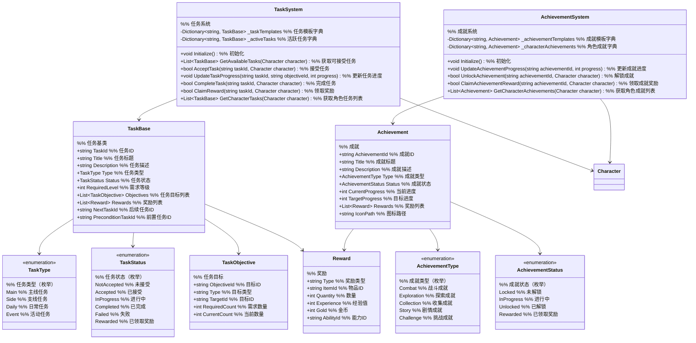

# 一期任务成就系统设计

## 1. 功能项概述与用例场景

任务成就系统负责游戏中的任务发布、追踪、完成和奖励发放，以及成就解锁和展示功能。本系统一期实现以下核心功能：

| 功能项         | 描述                                                         | 实际游戏用例场景 |
|----------------|--------------------------------------------------------------|------------------|
| 主线任务系统   | 实现推动游戏剧情发展的主线任务                                 | **场景1：剧情引导**<br>玩家完成"初入山门"任务，解锁新的游戏区域<br>**场景2：任务追踪**<br>UI显示当前主线任务目标和进度 |
| 支线任务系统   | 实现丰富游戏内容的支线任务                                     | **场景1：NPC委托**<br>村民请求玩家帮忙消灭附近的妖兽<br>**场景2：探索任务**<br>发现隐藏的宝藏地点 |
| 成就系统       | 实现游戏中的成就解锁和奖励机制                                 | **场景1：首次击败BOSS**<br>玩家首次击败狼王解锁"狼王杀手"成就<br>**场景2：收集成就**<br>收集10种不同药材解锁"草药大师"成就 |

## 2. 系统架构图



### 架构设计用例说明

**为什么将任务和成就系统分离？**
- **用例1：功能差异** - 任务有明确的目标和完成条件，而成就通常是长期挑战
- **用例2：数据结构不同** - 任务需要追踪进度和状态变化，成就需要记录完成度

**为什么使用任务类型和成就类型枚举？**
- **用例1：分类管理** - 便于区分主线、支线等不同类型任务的处理逻辑
- **用例2：UI展示** - 不同类型的任务和成就可以在UI中有不同的展示方式

### 主要功能流程说明

#### 流程1：任务接受与完成流程

```
场景：玩家与NPC对话接受任务

1. NPC系统 → TaskSystem
   调用：GetAvailableTasks(attributeManager, inventory)
   说明：获取玩家可接受的任务

2. TaskSystem → NPC系统
   返回：List~TaskBase~
   说明：返回可接受任务列表

3. NPC系统 → UI系统
   触发：ShowTaskDialog(availableTasks)
   说明：显示任务对话界面

4. 玩家 → UI系统
   操作：选择接受任务

5. UI系统 → TaskSystem
   调用：AcceptTask(taskId, attributeManager)
   说明：请求接受任务

6. TaskSystem 内部处理
   a. 验证任务条件（等级、前置任务等）
   b. 创建任务实例，设置状态为Accepted
   c. 将任务添加到玩家的活跃任务列表
   d. 更新玩家数据

7. TaskSystem → UI系统
   触发：OnTaskAccepted(task)
   说明：通知任务已接受

8. UI系统 → 玩家
   显示：任务接受消息，更新任务追踪界面

9. 游戏过程中
   各系统 → TaskSystem
   调用：UpdateTaskProgress(taskId, objectiveId, progress)
   说明：更新任务进度

10. 当任务所有目标完成
    TaskSystem → UI系统
    触发：OnTaskCompleted(taskId)
    说明：通知任务已完成

11. 玩家 → UI系统
    操作：领取任务奖励

12. UI系统 → TaskSystem
    调用：ClaimReward(taskId, attributeManager, inventory)
    说明：请求领取奖励

13. TaskSystem 内部处理
    a. 发放奖励（物品、经验、金币等）
       - 物品奖励：inventory.AddItem(item, quantity)
       - 经验奖励：attributeManager.AddExperience(experience)
       - 属性奖励：attributeManager.AddAttribute(attributeId, value)
    b. 更新任务状态为Rewarded
    c. 解锁后续任务（如有）

14. TaskSystem → UI系统
    触发：OnRewardClaimed(taskId, rewards)
    说明：通知奖励已领取

15. UI系统 → 玩家
    显示：奖励领取消息，更新背包/属性界面
```

#### 流程2：成就解锁流程

```
场景：玩家达到成就条件

1. 游戏系统 → AchievementSystem
   调用：UpdateAchievementProgress(achievementId, progress)
   说明：更新成就进度

2. AchievementSystem 内部处理
   a. 查找玩家的成就数据
   b. 更新当前进度
   c. 检查是否达到解锁条件
   d. 如果达到：
      i. 更新成就状态为Unlocked
      ii. 生成解锁通知
      iii. 记录解锁时间

3. AchievementSystem → UI系统
   触发：OnAchievementUnlocked(achievement)
   说明：通知成就已解锁

4. UI系统 → 玩家
   显示：成就解锁动画和消息

5. 玩家 → UI系统
   操作：查看成就详情并领取奖励

6. UI系统 → AchievementSystem
   调用：ClaimAchievementReward(achievementId, attributeManager, inventory)
   说明：请求领取成就奖励

7. AchievementSystem 内部处理
   a. 发放奖励
      - 物品奖励：inventory.AddItem(item, quantity)
      - 经验奖励：attributeManager.AddExperience(experience)
      - 属性奖励：attributeManager.AddAttribute(attributeId, value)
   b. 更新成就状态为Rewarded

8. AchievementSystem → UI系统
   触发：OnAchievementRewardClaimed(achievementId, rewards)
   说明：通知奖励已领取

9. UI系统 → 玩家
   显示：奖励领取消息
```

## 3. 数据结构设计

### 3.1 任务和成就枚举

```csharp
public enum TaskType
{
    // 主线任务
    Main,
    // 支线任务
    Side,
    // 日常任务
    Daily,
    // 活动任务
    Event
}

public enum TaskStatus
{
    // 未接受
    NotAccepted,
    // 已接受
    Accepted,
    // 进行中
    InProgress,
    // 已完成
    Completed,
    // 失败
    Failed,
    // 已领取奖励
    Rewarded
}

public enum AchievementType
{
    // 战斗成就
    Combat,
    // 探索成就
    Exploration,
    // 收集成就
    Collection,
    // 剧情成就
    Story,
    // 挑战成就
    Challenge
}

public enum AchievementStatus
{
    // 未解锁
    Locked,
    // 进行中
    InProgress,
    // 已解锁
    Unlocked,
    // 已领取奖励
    Rewarded
}
```

### 3.2 任务数据结构

```csharp
public class TaskBase
{
    public string TaskId { get; set; }
    public string Title { get; set; }
    public string Description { get; set; }
    public TaskType Type { get; set; }
    public TaskStatus Status { get; set; }
    public int RequiredLevel { get; set; }
    public List<TaskObjective> Objectives { get; set; }
    public List<Reward> Rewards { get; set; }
    public string NextTaskId { get; set; }
    public string PreconditionTaskId { get; set; }
    public string IconPath { get; set; }
}

public class TaskObjective
{
    public string ObjectiveId { get; set; }
    public string Type { get; set; }
    public string TargetId { get; set; }
    public int RequiredCount { get; set; }
    public int CurrentCount { get; set; }
    public string Description { get; set; }

    // 检查目标是否完成
    public bool IsCompleted()
    {
        return CurrentCount >= RequiredCount;
    }
}
```

### 3.3 成就数据结构

```csharp
public class Achievement
{
    public string AchievementId { get; set; }
    public string Title { get; set; }
    public string Description { get; set; }
    public AchievementType Type { get; set; }
    public AchievementStatus Status { get; set; }
    public int CurrentProgress { get; set; }
    public int TargetProgress { get; set; }
    public List<Reward> Rewards { get; set; }
    public string IconPath { get; set; }
    public DateTime? UnlockTime { get; set; }

    // 检查是否可解锁
    public bool CanUnlock()
    {
        return Status == AchievementStatus.InProgress && CurrentProgress >= TargetProgress;
    }
}
```

### 3.4 奖励数据结构

```csharp
public class Reward
{
    public string Type { get; set; }
    public string ItemId { get; set; }
    public int Quantity { get; set; }
    public int Experience { get; set; }
    public int Gold { get; set; }
    public string AbilityId { get; set; }
    public int AttributePoints { get; set; }
}
```

## 4. 接口设计与用例场景

### 4.1 任务系统接口

```csharp
public interface ITaskSystem
{
    // 初始化任务系统
    void Initialize();

    // 获取可接受的任务
    List<TaskBase> GetAvailableTasks(IAttributeManager attributeManager, IInventory inventory);

    // 接受任务
    bool AcceptTask(string taskId, IAttributeManager attributeManager);

    // 更新任务进度
    void UpdateTaskProgress(string taskId, string objectiveId, int progress);

    // 完成任务
    bool CompleteTask(string taskId, IAttributeManager attributeManager);

    // 领取奖励
    bool ClaimReward(string taskId, IAttributeManager attributeManager, IInventory inventory);

    // 获取角色的任务列表
    List<TaskBase> GetCharacterTasks(string characterId);

    // 获取任务模板
    TaskBase GetTaskTemplate(string taskId);
}
```

### 4.2 成就系统接口

```csharp
public interface IAchievementSystem
{
    // 初始化成就系统
    void Initialize();

    // 更新成就进度
    void UpdateAchievementProgress(string achievementId, int progress);

    // 解锁成就
    bool UnlockAchievement(string achievementId, string characterId);

    // 领取成就奖励
    bool ClaimAchievementReward(string achievementId, IAttributeManager attributeManager, IInventory inventory);

    // 获取角色的成就列表
    List<Achievement> GetCharacterAchievements(string characterId);

    // 获取成就模板
    Achievement GetAchievementTemplate(string achievementId);
}
```

## 5. 实现细节

### 5.1 配置表设计

为了提高系统的灵活性和可维护性，一期实现以下配置表：

#### 5.1.1 任务配置表 (TaskConfig.csv)

| 字段名            | 类型   | 描述                          | 示例值                     |
|-------------------|--------|-------------------------------|----------------------------|
| TaskId            | string | 任务ID                        | main_001, side_001         |
| TaskTitle         | string | 任务标题                      | 初入山门, 消灭妖兽         |
| Description       | string | 任务描述                      | 前往山门报道, 消灭5只野狼  |
| TaskType          | string | 任务类型 (Main/Side等)        | Main, Side                 |
| RequiredLevel     | int    | 需求等级                      | 1, 5                       |
| PreconditionTaskId| string | 前置任务ID                    | , main_001                 |
| NextTaskId        | string | 后续任务ID                    | main_002,                  |
| IconPath          | string | 图标路径                      | icons/tasks/main_001.png   |

#### 5.1.2 任务目标配置表 (TaskObjectiveConfig.csv)

| 字段名            | 类型   | 描述                          | 示例值                     |
|-------------------|--------|-------------------------------|----------------------------|
| TaskId            | string | 所属任务ID                    | main_001, side_001         |
| ObjectiveId       | string | 目标ID                        | obj_001, obj_002           |
| ObjectiveType     | string | 目标类型                      | kill, collect, talk        |
| TargetId          | string | 目标ID                        | wolf, herb_001, npc_001    |
| RequiredCount     | int    | 需求数量                      | 5, 3, 1                    |
| ObjectiveDesc     | string | 目标描述                      | 消灭5只野狼, 收集3株草药   |

#### 5.1.3 任务奖励配置表 (TaskRewardConfig.csv)

| 字段名            | 类型   | 描述                          | 示例值                     |
|-------------------|--------|-------------------------------|----------------------------|
| TaskId            | string | 所属任务ID                    | main_001, side_001         |
| RewardType        | string | 奖励类型                      | item, experience, gold     |
| ItemId            | string | 物品ID (类型为item时有效)     | sword_001, potion_001      |
| Quantity          | int    | 数量                          | 1, 500, 100                |
| Experience        | int    | 经验值 (类型为experience时有效)| 100, 500                   |
| Gold              | int    | 金币 (类型为gold时有效)       | 50, 200                    |
| AbilityId         | string | 能力ID (类型为ability时有效)  | fire_ball, tough_skin      |
| AttributePoints   | int    | 属性点 (类型为attribute时有效)| 1, 2                       |

#### 5.1.4 成就配置表 (AchievementConfig.csv)

| 字段名            | 类型   | 描述                          | 示例值                     |
|-------------------|--------|-------------------------------|----------------------------|
| AchievementId     | string | 成就ID                        | combat_001, explore_001    |
| AchievementTitle  | string | 成就标题                      | 狼王杀手, 草药大师         |
| Description       | string | 成就描述                      | 首次击败狼王, 收集10种草药 |
| AchievementType   | string | 成就类型                      | Combat, Collection         |
| TargetProgress    | int    | 目标进度                      | 1, 10                      |
| IconPath          | string | 图标路径                      | icons/achievements/wolf_killer.png |

#### 5.1.5 成就奖励配置表 (AchievementRewardConfig.csv)

| 字段名            | 类型   | 描述                          | 示例值                     |
|-------------------|--------|-------------------------------|----------------------------|
| AchievementId     | string | 所属成就ID                    | combat_001, explore_001    |
| RewardType        | string | 奖励类型                      | item, experience, gold     |
| ItemId            | string | 物品ID (类型为item时有效)     | rare_sword, special_potion |
| Quantity          | int    | 数量                          | 1, 1000                    |
| Experience        | int    | 经验值 (类型为experience时有效)| 1000, 2000                 |
| Gold              | int    | 金币 (类型为gold时有效)       | 500, 1000                  |
| AbilityId         | string | 能力ID (类型为ability时有效)  | fire_ball, tough_skin      |
| AttributePoints   | int    | 属性点 (类型为attribute时有效)| 1, 2                       |
```