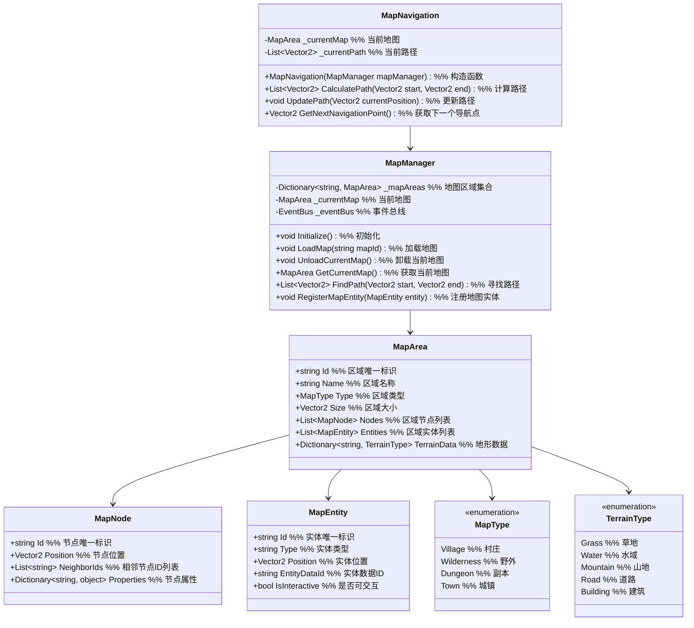

# 一期地图与导航系统设计

## 1. 功能项概述与用例场景

地图与导航系统负责构建游戏世界、实现地图探索和导航功能，为玩家提供沉浸式的游戏体验。本系统一期实现以下核心功能：

| 功能项         | 描述                                                         | 实际游戏用例场景 |
|----------------|--------------------------------------------------------------|------------------|
| 基础地图结构   | 构建1-2个简单区域地图，包含基本地形和互动元素                 | **场景1：新手村**<br>玩家出生在新手村，可探索房屋、商店和训练场地<br>**场景2：野外区域**<br>包含怪物刷新点、资源采集点和随机事件触发点 |
| 简单探索机制   | 实现基本的地图探索和资源收集玩法                             | **场景1：采集草药**<br>玩家点击地图上的药草图标进行采集，获得任务物品<br>**场景2：触发事件**<br>玩家走到特定位置触发宝箱事件，获得稀有物品 |
| 导航功能       | 提供简单的路径寻路和地图标记功能                             | **场景1：任务导航**<br>点击任务目标自动在小地图上显示路径<br>**场景2：地图标记**<br>玩家可在地图上标记重要位置，方便日后返回 |

## 2. 系统架构图



### 架构设计用例说明

**为什么使用节点图设计地图？**
- **用例1：路径寻路** - 节点图结构便于实现A*等寻路算法，计算玩家和NPC的移动路径
- **用例2：区域连接** - 不同地图区域通过节点连接，支持无缝切换和加载

**为什么将地图实体抽象为独立类？**
- **用例1：互动元素** - 地图上的宝箱、采集点等互动元素统一管理，便于添加交互逻辑
- **用例2：动态生成** - 支持运行时动态添加和移除地图实体，实现随机事件和动态内容

### 主要功能流程说明

#### 流程1：地图加载流程

```
场景：玩家从新手村进入野外区域

1. 玩家输入 → MapManager
   调用：LoadMap("wilderness_1")
   说明：请求加载野外区域地图

2. MapManager 内部处理
   - 检查当前是否有已加载的地图
   - 如果有：卸载当前地图 UnloadCurrentMap()
   - 加载新地图数据：从配置表读取地图节点、地形和实体信息
   - 创建 MapArea 实例
   - 设置 _currentMap = newMap
   - 初始化地图实体

3. MapManager → 渲染系统
   触发：OnMapLoaded(newMap)
   说明：通知渲染系统绘制新地图

4. MapManager → 导航系统
   触发：OnMapChanged(newMap)
   说明：通知导航系统更新路径计算

5. 地图加载完成
   MapManager → UI系统
   触发：OnMapReady()
   说明：通知UI系统显示新地图信息
```

#### 流程2：路径寻路流程

```
场景：玩家点击地图上的任务目标位置

1. UI系统 → MapNavigation
   调用：CalculatePath(playerPosition, targetPosition)
   说明：请求计算从玩家位置到目标位置的路径

2. MapNavigation 内部处理
   - 获取当前地图 _currentMap
   - 使用A*算法计算路径：
     a. 将玩家位置和目标位置转换为地图节点
     b. 寻找最短路径节点序列
     c. 将节点序列转换为世界坐标路径点
   - 存储路径 _currentPath
   - 返回路径点列表

3. MapNavigation → 移动系统
   触发：OnPathCalculated(_currentPath)
   说明：通知移动系统执行自动导航

4. 导航过程中
   MapNavigation → 移动系统
   调用：UpdatePath(playerCurrentPosition)
   说明：根据玩家当前位置更新导航路径

5. 到达目标
   MapNavigation → UI系统
   触发：OnNavigationComplete()
   说明：通知UI系统导航已完成
```

## 3. 数据结构设计

### 3.1 地图类型枚举

```csharp
public enum MapType
{
    // 村庄
    Village,
    // 野外
    Wilderness,
    //  dungeon
    Dungeon,
    // 城镇
    Town
}

public enum TerrainType
{
    // 草地
    Grass,
    // 水域
    Water,
    // 山地
    Mountain,
    // 道路
    Road,
    // 建筑
    Building
}
```

### 3.2 地图节点结构

```csharp
public class MapNode
{
    public string Id { get; set; }
    public Vector2 Position { get; set; }
    public List<string> NeighborIds { get; set; }
    public Dictionary<string, object> Properties { get; set; }

    public MapNode()
    {
        NeighborIds = new List<string>();
        Properties = new Dictionary<string, object>();
    }
}
```

### 3.3 地图区域结构

```csharp
public class MapArea
{
    public string Id { get; set; }
    public string Name { get; set; }
    public MapType Type { get; set; }
    public Vector2 Size { get; set; }
    public List<MapNode> Nodes { get; set; }
    public List<MapEntity> Entities { get; set; }
    public Dictionary<string, TerrainType> TerrainData { get; set; }

    public MapArea()
    {
        Nodes = new List<MapNode>();
        Entities = new List<MapEntity>();
        TerrainData = new Dictionary<string, TerrainType>();
    }
}
```

### 3.4 地图实体结构

```csharp
public class MapEntity
{
    public string Id { get; set; }
    public string Type { get; set; }
    public Vector2 Position { get; set; }
    public string EntityDataId { get; set; }
    public bool IsInteractive { get; set; }
}
```

## 4. 接口设计与用例场景

### 4.1 地图管理器接口

```csharp
public interface IMapManager
{
    // 初始化地图系统
    void Initialize();

    // 加载地图
    void LoadMap(string mapId);

    // 卸载当前地图
    void UnloadCurrentMap();

    // 获取当前地图
    MapArea GetCurrentMap();

    // 寻找路径
    List<Vector2> FindPath(Vector2 start, Vector2 end);

    // 注册地图实体
    void RegisterMapEntity(MapEntity entity);

    // 移除地图实体
    void RemoveMapEntity(string entityId);

    // 获取地图实体
    MapEntity GetMapEntity(string entityId);
}
```

### 4.2 导航系统接口

```csharp
public interface IMapNavigation
{
    // 计算路径
    List<Vector2> CalculatePath(Vector2 start, Vector2 end);

    // 更新路径
    void UpdatePath(Vector2 currentPosition);

    // 获取下一个导航点
    Vector2 GetNextNavigationPoint();

    // 取消导航
    void CancelNavigation();

    // 检查是否在导航中
    bool IsNavigating();

    // 设置导航精度
    void SetNavigationPrecision(float precision);
}
```

## 5. 实现细节

### 5.1 配置表设计

为了提高系统的灵活性和可维护性，一期实现以下配置表：

#### 5.1.1 地图配置表 (MapConfig.csv)

| 字段名        | 类型   | 描述                          | 示例值                     |
|---------------|--------|-------------------------------|----------------------------|
| MapId         | string | 地图唯一标识                  | village_start, wilderness_1 |
| MapName       | string | 地图名称                      | 新手村, 青苍山            |
| MapType       | string | 地图类型 (Village/Wilderness等) | Village, Wilderness       |
| Width         | float  | 地图宽度                      | 1000, 2000                 |
| Height        | float  | 地图高度                      | 800, 1500                  |
| BackgroundId  | string | 背景图ID                      | bg_village, bg_wilderness  |
| MusicId       | string | 背景音乐ID                    | music_village, music_wild  |

#### 5.1.2 地图节点配置表 (MapNodeConfig.csv)

| 字段名        | 类型   | 描述                          | 示例值                     |
|---------------|--------|-------------------------------|----------------------------|
| MapId         | string | 所属地图ID                    | village_start, wilderness_1 |
| NodeId        | string | 节点ID                        | node_001, node_002         |
| X             | float  | X坐标                         | 100, 200                   |
| Y             | float  | Y坐标                         | 150, 250                   |
| NeighborIds   | string | 相邻节点ID列表 (逗号分隔)     | node_002,node_003, node_001,node_004 |
| IsPassable    | bool   | 是否可通行                    | true, false                |
| TerrainType   | string | 地形类型                      | Grass, Road                |

#### 5.1.3 地图实体配置表 (MapEntityConfig.csv)

| 字段名        | 类型   | 描述                          | 示例值                     |
|---------------|--------|-------------------------------|----------------------------|
| MapId         | string | 所属地图ID                    | village_start, wilderness_1 |
| EntityId      | string | 实体ID                        | npc_blacksmith, chest_001  |
| EntityType    | string | 实体类型                      | NPC, Chest, Resource       |
| X             | float  | X坐标                         | 300, 450                   |
| Y             | float  | Y坐标                         | 200, 350                   |
| EntityDataId  | string | 实体数据ID                    | npc_001, chest_common      |
| IsInteractive | bool   | 是否可交互                    | true, true                 |
| RespawnTime   | float  | 刷新时间 (秒，0表示不刷新)    | 0, 300                     |
```