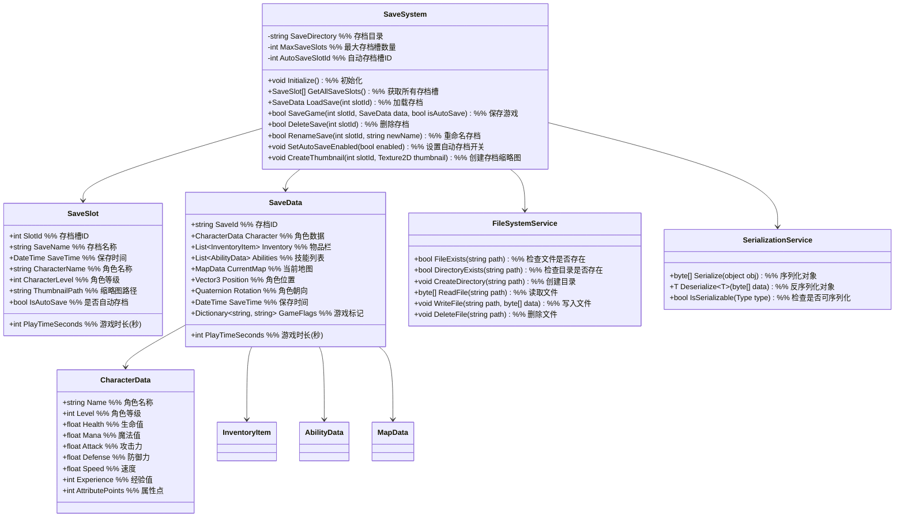

# 一期存档系统设计

## 1. 功能项概述与用例场景

存档系统负责游戏数据的持久化存储和加载，确保玩家的游戏进度能够被保存和恢复。本系统一期实现以下核心功能：

| 功能项         | 描述                                                         | 实际游戏用例场景 |
|----------------|--------------------------------------------------------------|------------------|
| 基础存档功能   | 实现游戏数据的保存和加载机制，支持多个存档位                   | **场景1：手动存档**<br>玩家在游戏中点击"保存游戏"按钮，系统创建或更新存档<br>**场景2：读取存档**<br>玩家从主菜单选择"加载游戏"，系统读取指定存档 |
| 自动存档机制   | 设计在关键节点自动保存游戏进度的机制                           | **场景1：关卡完成自动存档**<br>玩家完成一个区域探索后，系统自动保存进度<br>**场景2：重要事件自动存档**<br>击败BOSS后，系统自动保存游戏状态 |
| 存档管理功能   | 提供存档列表查看、删除、重命名等管理功能                       | **场景1：删除存档**<br>玩家删除不需要的旧存档<br>**场景2：重命名存档**<br>玩家为存档添加描述性名称 |

## 2. 系统架构图



### 架构设计用例说明

**为什么将序列化和文件系统操作分离？**
- **用例1：可扩展性** - 便于替换不同的序列化方式（如JSON、二进制）
- **用例2：测试性** - 可以独立测试序列化逻辑和文件操作

**为什么使用存档槽机制？**
- **用例1：多存档支持** - 允许多个玩家或同一玩家的不同游戏进度
- **用例2：自动存档隔离** - 自动存档不会覆盖手动存档，提供额外保障

### 主要功能流程说明

#### 流程1：保存游戏流程

```
场景：玩家点击"保存游戏"按钮

1. UI系统 → SaveSystem
   调用：RequestSaveGame(slotId, saveName)
   说明：请求保存游戏到指定存档槽

2. SaveSystem → 游戏各系统
   调用：CollectSaveData()
   说明：收集角色、物品、地图等系统的当前状态

3. 各系统 → SaveSystem
   返回：CharacterData, InventoryData, AbilityData, MapData等
   说明：提供各自系统的序列化数据

4. SaveSystem 内部处理
   a. 创建SaveData对象，整合所有收集的数据
   b. 生成缩略图（如有需要）
   c. 调用SerializationService.Serialize(saveData)
   d. 调用FileSystemService.WriteFile(savePath, serializedData)
   e. 更新SaveSlot信息（保存时间、角色等级等）

5. SaveSystem → UI系统
   触发：OnSaveCompleted(success, message)
   说明：通知保存结果

6. UI系统 → 玩家
   显示：保存成功/失败消息
```

#### 流程2：加载游戏流程

```
场景：玩家从主菜单选择"加载游戏"

1. UI系统 → SaveSystem
   调用：GetAllSaveSlots()
   说明：获取所有存档槽信息

2. SaveSystem → UI系统
   返回：SaveSlot[]
   说明：返回存档槽数组

3. UI系统 → 玩家
   显示：存档列表界面

4. 玩家 → UI系统
   操作：选择一个存档槽

5. UI系统 → SaveSystem
   调用：LoadSave(slotId)
   说明：请求加载指定存档

6. SaveSystem 内部处理
   a. 调用FileSystemService.ReadFile(savePath)
   b. 调用SerializationService.Deserialize~SaveData~(data)
   c. 验证存档数据完整性

7. SaveSystem → 游戏各系统
   调用：ApplySaveData(saveData)
   说明：应用存档数据到各系统

8. 各系统 → SaveSystem
   触发：OnSystemLoaded()
   说明：通知系统已加载完成

9. SaveSystem → UI系统
   触发：OnLoadCompleted(success, message)
   说明：通知加载结果

10. UI系统 → 玩家
    显示：加载成功/失败消息，如成功则进入游戏
```

## 3. 数据结构设计

### 3.1 存档槽信息

```csharp
public class SaveSlot
{
    public int SlotId { get; set; }
    public string SaveName { get; set; }
    public DateTime SaveTime { get; set; }
    public string CharacterName { get; set; }
    public int CharacterLevel { get; set; }
    public string ThumbnailPath { get; set; }
    public bool IsAutoSave { get; set; }
    public int PlayTimeSeconds { get; set; }

    // 获取格式化的游戏时间
    public string GetFormattedPlayTime()
    {
        int hours = PlayTimeSeconds / 3600;
        int minutes = (PlayTimeSeconds % 3600) / 60;
        int seconds = PlayTimeSeconds % 60;
        return $"{hours:D2}:{minutes:D2}:{seconds:D2}";
    }
}
```

### 3.2 存档数据结构

```csharp
public class SaveData
{
    public string SaveId { get; set; }
    public CharacterData Character { get; set; }
    public List<InventoryItem> Inventory { get; set; }
    public List<AbilityData> Abilities { get; set; }
    public MapData CurrentMap { get; set; }
    public Vector3 Position { get; set; }
    public Quaternion Rotation { get; set; }
    public int PlayTimeSeconds { get; set; }
    public DateTime SaveTime { get; set; }
    public Dictionary<string, string> GameFlags { get; set; }
}

public class CharacterData
{
    public string Name { get; set; }
    public int Level { get; set; }
    public float Health { get; set; }
    public float MaxHealth { get; set; }
    public float Mana { get; set; }
    public float MaxMana { get; set; }
    public float Attack { get; set; }
    public float Defense { get; set; }
    public float Speed { get; set; }
    public int Experience { get; set; }
    public int AttributePoints { get; set; }
}

public class InventoryItem
{
    public string ItemId { get; set; }
    public int Quantity { get; set; }
    public bool IsEquipped { get; set; }
    public Dictionary<string, string> CustomData { get; set; }
}

public class AbilityData
{
    public string AbilityId { get; set; }
    public int Level { get; set; }
    public float CurrentValue { get; set; }
}

public class MapData
{
    public string MapId { get; set; }
    public int Floor { get; set; }
    public Dictionary<string, bool> DiscoveredAreas { get; set; }
}
```

## 4. 接口设计与用例场景

### 4.1 存档系统接口

```csharp
public interface ISaveSystem
{
    // 初始化存档系统
    void Initialize();

    // 获取所有存档槽
    SaveSlot[] GetAllSaveSlots();

    // 加载存档
    SaveData LoadSave(int slotId);

    // 保存游戏
    bool SaveGame(int slotId, SaveData data, bool isAutoSave = false);

    // 删除存档
    bool DeleteSave(int slotId);

    // 重命名存档
    bool RenameSave(int slotId, string newName);

    // 设置自动存档是否启用
    void SetAutoSaveEnabled(bool enabled);

    // 创建存档缩略图
    void CreateThumbnail(int slotId, Texture2D thumbnail);

    // 获取最大存档槽数量
    int GetMaxSaveSlots();
}
```

### 4.2 文件系统服务接口

```csharp
public interface IFileSystemService
{
    // 检查文件是否存在
    bool FileExists(string path);

    // 检查目录是否存在
    bool DirectoryExists(string path);

    // 创建目录
    void CreateDirectory(string path);

    // 读取文件
    byte[] ReadFile(string path);

    // 写入文件
    void WriteFile(string path, byte[] data);

    // 删除文件
    void DeleteFile(string path);
}
```

### 4.3 序列化服务接口

```csharp
public interface ISerializationService
{
    // 序列化对象
    byte[] Serialize(object obj);

    // 反序列化对象
    T Deserialize<T>(byte[] data);

    // 检查对象是否可序列化
    bool IsSerializable(Type type);
}
```

## 5. 实现细节

### 5.1 配置表设计

为了提高系统的灵活性和可维护性，一期实现以下配置表：

#### 5.1.1 存档系统配置表 (SaveSystemConfig.csv)

| 字段名           | 类型   | 描述                          | 示例值                     |
|------------------|--------|-------------------------------|----------------------------|
| MaxSaveSlots     | int    | 最大存档槽数量                | 5                          |
| AutoSaveEnabled  | bool   | 是否启用自动存档              | true                       |
| AutoSaveSlotId   | int    | 自动存档槽ID                  | 0                          |
| SaveDirectory    | string | 存档目录路径                  | saves/                     |
| ThumbnailWidth   | int    | 缩略图宽度                    | 200                        |
| ThumbnailHeight  | int    | 缩略图高度                    | 150                        |
| CompressSaveData | bool   | 是否压缩存档数据              | true                       |
| EncryptSaveData  | bool   | 是否加密存档数据              | false                      |

#### 5.1.2 自动存档触发点配置表 (AutoSaveTriggerConfig.csv)

| 字段名          | 类型   | 描述                          | 示例值                     |
|-----------------|--------|-------------------------------|----------------------------|
| TriggerId       | string | 触发点ID                      | level_complete, boss_defeat|
| TriggerName     | string | 触发点名称                    | 关卡完成, BOSS击败         |
| Description     | string | 触发点描述                    | 玩家完成关卡后触发自动存档  |
| DelaySeconds    | int    | 延迟触发时间(秒)              | 2                          |
```