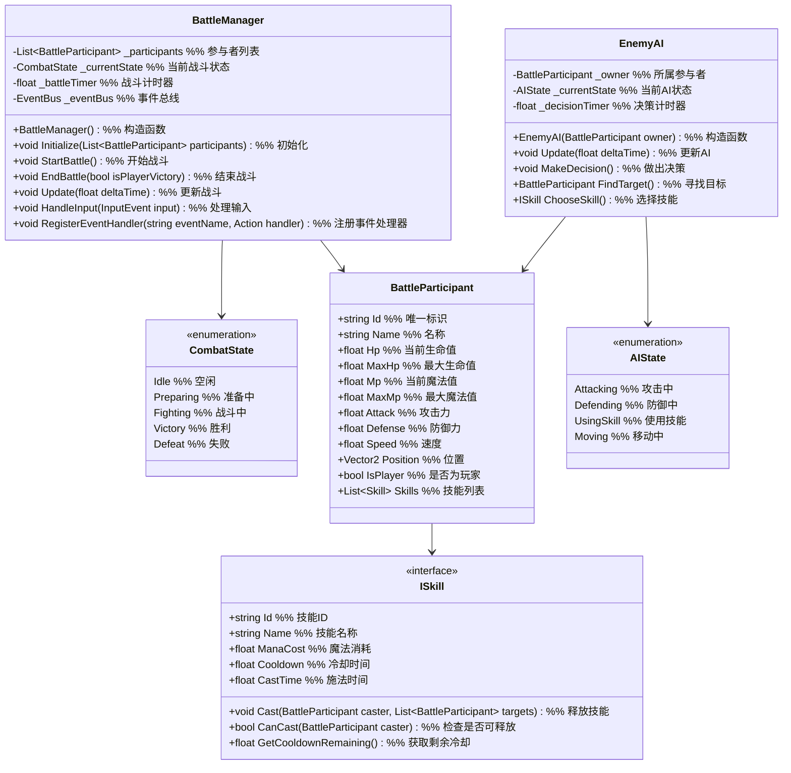

# 一期战斗系统设计

## 1. 功能项概述与用例场景

战斗系统是游戏的核心玩法系统之一，负责实现即时制战斗流程、技能释放和敌人AI行为。本系统一期实现以下核心功能：

| 功能项         | 描述                                                         | 实际游戏用例场景 |
|----------------|--------------------------------------------------------------|------------------|
| 基础战斗逻辑   | 实现即时制战斗流程，大地图中进入小场景后触发即时战斗，包括角色移动、技能释放、伤害结算等 | **场景1：野外遇敌**<br>玩家在地图中行走时触发随机战斗，进入战斗场景后可控制角色移动和攻击<br>**场景2：Boss战**<br>玩家到达特定区域后触发Boss战，需要通过灵活操作和技能释放击败强大敌人 |
| 简单技能系统   | 提供基础技能体系，包括普通攻击和1-2个特色技能                         | **场景1：技能连招**<br>玩家先使用"横扫千军"技能造成范围伤害，再使用"单体爆发"技能攻击残血敌人<br>**场景2：技能打断**<br>敌人释放大招时，玩家使用"眩晕打击"技能打断其施法 |
| AI行为         | 实现简单的敌人AI逻辑，如优先攻击、防御或使用技能                     | **场景1：敌人仇恨**<br>敌人会优先攻击对其造成伤害最高的目标<br>**场景2：智能躲避**<br>当玩家释放范围技能时，敌人会尝试移动到技能范围外 |

## 2. 系统架构图



### 架构设计用例说明

**为什么使用状态机设计战斗流程？**
- **用例1：战斗阶段转换** - 从准备阶段到战斗阶段，再到胜利/失败阶段，状态机清晰管理各阶段逻辑
- **用例2：战斗中断处理** - 当玩家逃跑或触发特殊事件时，可通过状态转换平滑处理战斗中断

**为什么将战斗参与者抽象为统一类？**
- **用例1：组队系统扩展** - 未来添加队友系统时，只需创建新的BattleParticipant实例即可
- **用例2：敌人多样性** - 不同类型敌人只需继承BattleParticipant并调整属性和技能

**为什么使用事件总线？**
- **用例1：战斗结果通知** - 战斗结束后通过事件通知UI系统显示胜利/失败界面
- **用例2：成就解锁** - 战斗中达成特定条件时触发成就解锁事件

### 主要功能流程说明

#### 流程1：战斗初始化流程

```
场景：玩家在地图中触发战斗

1. 地图系统 → BattleManager
   调用：Initialize(participants)
   说明：传入玩家和敌人信息初始化战斗

2. BattleManager 内部处理
   - 创建参与者列表 _participants
   - 设置战斗状态 _currentState = CombatState.Preparing
   - 初始化战斗计时器 _battleTimer = 0
   - 注册战斗相关事件处理器

3. BattleManager → UI系统
   触发：OnBattleStarted()
   说明：通知UI系统显示战斗界面

4. 进入战斗准备阶段
   - 播放战斗开始动画
   - 显示双方参与者信息
   - 倒计时3秒后进入战斗阶段

5. BattleManager 内部状态更新
   设置：_currentState = CombatState.Fighting
```

#### 流程2：技能释放流程

```
场景：玩家点击技能按钮释放技能

1. UI系统 → BattleManager
   调用：HandleInput(SkillInput)
   说明：传递玩家技能释放指令

2. BattleManager → BattleParticipant(玩家)
   调用：GetSkill(skillId).CanCast(player)
   说明：检查技能是否可以释放

3. 如果技能可释放
   BattleManager → ISkill
   调用：Cast(player, targets)
   说明：执行技能释放逻辑

4. 技能效果处理
   - 扣除玩家法力值
   - 应用技能伤害/治疗效果
   - 启动技能冷却
   - 播放技能动画和特效

5. BattleManager → 外部系统
   触发：OnSkillCast(player, skill, targets)
   说明：通知相关系统技能已释放
```

#### 流程3：敌人AI决策流程

```
场景：敌人回合进行决策

1. BattleManager → EnemyAI
   调用：Update(deltaTime)
   说明：更新AI状态

2. EnemyAI 内部处理
   - 更新决策计时器 _decisionTimer -= deltaTime
   - 如果计时器 <= 0:
     - 调用 MakeDecision()
     - 重置计时器 _decisionTimer = Random(1.0f, 3.0f)

3. MakeDecision() 处理逻辑
   a. 查找目标：BattleParticipant target = FindTarget()
   b. 选择技能：ISkill skill = ChooseSkill()
   c. 执行动作：
      - 如果选择普通攻击：直接攻击目标
      - 如果选择技能：释放技能
      - 如果需要移动：计算路径并移动

4. EnemyAI → BattleManager
   触发：OnAIAction(owner, actionType, target, skill)
   说明：通知战斗管理器AI执行的动作
```

#### 流程4：战斗结束流程

```
场景：一方所有参与者生命值归0

1. BattleManager 内部检查
   - 检查玩家方是否全灭
   - 检查敌人方是否全灭
   - 如果有一方全灭，进入结束流程

2. 决定战斗结果
   - 如果玩家方胜利：_currentState = CombatState.Victory
   - 如果玩家方失败：_currentState = CombatState.Defeat

3. BattleManager → 外部系统
   触发：OnBattleEnded(isPlayerVictory)
   说明：通知各系统战斗已结束

4. 战斗奖励处理（如果玩家胜利）
   - 经验系统：添加经验值
   - 物品系统：掉落物品
   - 任务系统：更新任务进度

5. 战斗界面处理
   - 播放胜利/失败动画
   - 显示奖励信息（如果胜利）
   - 倒计时返回地图界面
```

## 3. 数据结构设计

### 3.1 战斗状态枚举

```csharp
public enum CombatState
{
    // 战斗未开始
    Idle,
    // 战斗准备阶段
    Preparing,
    // 战斗进行中
    Fighting,
    // 战斗胜利
    Victory,
    // 战斗失败
    Defeat
}
```

### 3.2 战斗参与者结构

```csharp
public class BattleParticipant
{
    public string Id { get; set; }
    public string Name { get; set; }
    public float Hp { get; set; }
    public float MaxHp { get; set; }
    public float Mp { get; set; }
    public float MaxMp { get; set; }
    public float Attack { get; set; }
    public float Defense { get; set; }
    public float Speed { get; set; }
    public Vector2 Position { get; set; }
    public bool IsPlayer { get; set; }
    public List<ISkill> Skills { get; set; }
    public Dictionary<string, float> Buffs { get; set; }

    // 构造函数
    public BattleParticipant()
    {
        Skills = new List<ISkill>();
        Buffs = new Dictionary<string, float>();
    }

    // 受到伤害
    public void TakeDamage(float damage)
    {
        // 计算最终伤害（考虑防御）
        float finalDamage = Math.Max(1, damage - Defense * 0.1f);
        Hp = Math.Max(0, Hp - finalDamage);
    }

    // 治疗
    public void Heal(float amount)
    {
        Hp = Math.Min(MaxHp, Hp + amount);
    }
}
```

### 3.3 技能接口

```csharp
public interface ISkill
{
    string Id { get; }
    string Name { get; }
    float ManaCost { get; }
    float Cooldown { get; }
    float CastTime { get; }
    SkillType Type { get; }

    void Cast(BattleParticipant caster, List<BattleParticipant> targets);
    bool CanCast(BattleParticipant caster);
    float GetCooldownRemaining();
    void UpdateCooldown(float deltaTime);
}

public enum SkillType
{
    Attack,
    Defense,
    Buff,
    Debuff,
    Heal
}
```

## 4. 接口设计与用例场景

### 4.1 战斗管理器接口

```csharp
public interface IBattleManager
{
    // 初始化战斗
    void Initialize(List<BattleParticipant> participants);

    // 开始战斗
    void StartBattle();

    // 结束战斗
    void EndBattle(bool isPlayerVictory);

    // 更新战斗逻辑
    void Update(float deltaTime);

    // 处理输入
    void HandleInput(InputEvent input);

    // 注册事件处理器
    void RegisterEventHandler(string eventName, Action handler);

    // 获取当前战斗状态
    CombatState GetCurrentState();

    // 获取参与者列表
    List<BattleParticipant> GetParticipants();
}
```

### 4.2 敌人AI接口

```csharp
public interface IEnemyAI
{
    // 更新AI状态
    void Update(float deltaTime);

    // 做出决策
    void MakeDecision();

    // 寻找目标
    BattleParticipant FindTarget();

    // 选择技能
    ISkill ChooseSkill();

    // 设置AI难度
    void SetDifficulty(float difficulty);
}
```

## 5. 实现细节

### 5.1 战斗状态机实现

```csharp
public class BattleManager : IBattleManager
{
    private List<BattleParticipant> _participants;
    private CombatState _currentState;
    private float _battleTimer;
    private EventBus _eventBus;
    private Dictionary<string, List<Action>> _eventHandlers;

    public BattleManager()
    {
        _eventHandlers = new Dictionary<string, List<Action>>();
        _eventBus = EventBus.Instance;
    }

    public void Initialize(List<BattleParticipant> participants)
    {
        _participants = participants;
        _currentState = CombatState.Preparing;
        _battleTimer = 0;

        // 为每个敌人创建AI
        foreach (var participant in _participants)
        {
            if (!participant.IsPlayer)
            {
                var ai = new EnemyAI(participant);
                // 注册AI到战斗管理器
            }
        }
    }

    public void StartBattle()
    {
        _currentState = CombatState.Fighting;
        _eventBus.Publish("OnBattleStarted");
    }

    public void EndBattle(bool isPlayerVictory)
    {
        _currentState = isPlayerVictory ? CombatState.Victory : CombatState.Defeat;
        _eventBus.Publish("OnBattleEnded", isPlayerVictory);
    }

    public void Update(float deltaTime)
    {
        _battleTimer += deltaTime;

        switch (_currentState)
        {
            case CombatState.Preparing:
                // 准备阶段逻辑
                if (_battleTimer >= 3.0f) // 3秒准备时间
                {
                    StartBattle();
                }
                break;

            case CombatState.Fighting:
                // 战斗阶段逻辑
                UpdateParticipants(deltaTime);
                CheckBattleEndCondition();
                break;

            case CombatState.Victory:
            case CombatState.Defeat:
                // 结束阶段逻辑
                if (_battleTimer >= 5.0f) // 显示结果5秒
                {
                    // 返回地图
                }
                break;
        }
    }

    private void UpdateParticipants(float deltaTime)
    {
        // 更新所有参与者状态
        foreach (var participant in _participants)
        {
            // 更新技能冷却
            foreach (var skill in participant.Skills)
            {
                skill.UpdateCooldown(deltaTime);
            }

            // 更新 buff/debuff 效果
            UpdateBuffs(participant, deltaTime);
        }
    }

    private void CheckBattleEndCondition()
    {
        // 检查玩家是否全灭
        bool allPlayersDead = _participants.Where(p => p.IsPlayer).All(p => p.Hp <= 0);

        // 检查敌人是否全灭
        bool allEnemiesDead = _participants.Where(p => !p.IsPlayer).All(p => p.Hp <= 0);

        if (allPlayersDead)
        {
            EndBattle(false);
        }
        else if (allEnemiesDead)
        {
            EndBattle(true);
        }
    }

    // 其他方法实现...
}
```

### 5.2 技能实现示例

```csharp
public class BasicAttack : ISkill
{
    public string Id { get; private set; }
    public string Name { get; private set; }
    public float ManaCost { get; private set; }
    public float Cooldown { get; private set; }
    public float CastTime { get; private set; }
    public SkillType Type { get; private set; }

    private float _cooldownRemaining;

    public BasicAttack()
    {
        Id = "basic_attack";
        Name = "普通攻击";
        ManaCost = 0;
        Cooldown = 1.0f;
        CastTime = 0;
        Type = SkillType.Attack;
        _cooldownRemaining = 0;
    }

    public void Cast(BattleParticipant caster, List<BattleParticipant> targets)
    {
        if (!CanCast(caster) || targets == null || targets.Count == 0)
            return;

        // 扣除法力值
        caster.Mp -= ManaCost;

        // 重置冷却
        _cooldownRemaining = Cooldown;

        // 对第一个目标造成伤害
        var target = targets[0];
        float damage = caster.Attack * 1.2f; // 1.2倍攻击力
        target.TakeDamage(damage);

        // 触发攻击事件
        EventBus.Instance.Publish("OnSkillCast", caster, this, targets);
    }

    public bool CanCast(BattleParticipant caster)
    {
        return _cooldownRemaining <= 0 && caster.Mp >= ManaCost;
    }

    public float GetCooldownRemaining()
    {
        return _cooldownRemaining;
    }

    public void UpdateCooldown(float deltaTime)
    {
        if (_cooldownRemaining > 0)
        {
            _cooldownRemaining -= deltaTime;
        }
    }
}
```

## 6. 配置表设计

### 6.1 敌人配置表 (EnemyConfig.csv)

| 字段名        | 类型   | 描述                          | 示例值                     |
|---------------|--------|-------------------------------|----------------------------|
| EnemyId       | string | 敌人唯一标识                  | wolf, tiger, boss_dragon   |
| EnemyName     | string | 敌人名称                      | 野狼, 猛虎, 魔龙首领       |
| Level         | int    | 敌人等级                      | 1, 5, 10                   |
| Hp            | float  | 生命值                        | 100, 500, 2000             |
| Mp            | float  | 法力值                        | 50, 100, 500               |
| Attack        | float  | 攻击力                        | 10, 50, 200                |
| Defense       | float  | 防御力                        | 5, 20, 100                 |
| Speed         | float  | 速度                          | 5, 8, 15                   |
| SkillIds      | string | 技能ID列表（逗号分隔）        | basic_attack, howl         |
| AIType        | string | AI类型                        | aggressive, defensive      |
| DropItemIds   | string | 掉落物品ID列表（逗号分隔）    | potion_health, sword_bronze|
| DropRates     | string | 掉落概率列表（逗号分隔）      | 0.5, 0.1                   |
| Experience    | float  | 基础经验值                    | 10, 50, 200                |
| DifficultyCoefficient | float | 难度系数              | 1.0, 1.5, 3.0              |

### 6.2 技能配置表 (SkillConfig.csv)

| 字段名        | 类型   | 描述                          | 示例值                     |
|---------------|--------|-------------------------------|----------------------------|
| SkillId       | string | 技能唯一标识                  | basic_attack, fireball     |
| SkillName     | string | 技能名称                      | 普通攻击, 火球术           |
| ManaCost      | float  | 法力消耗                      | 0, 30                      |
| Cooldown      | float  | 冷却时间（秒）                | 1.0, 5.0                   |
| CastTime      | float  | 施法时间（秒）                | 0, 1.5                     |
| SkillType     | string | 技能类型                      | Attack, Buff               |
| DamageCoefficient | float | 伤害系数              | 1.2, 2.5                   |
| Range         | float  | 技能范围                      | 2.0, 5.0                   |
| AoERadius     | float  | 范围效果半径                  | 0, 3.0                     |
| TargetType    | string | 目标类型                      | Single, Multiple, Self     |
| EffectId      | string | 特效ID                        | hit_basic, explosion_fire  |
| Description   | string | 技能描述                      | 对单个目标造成物理伤害, 对范围内敌人造成火焰伤害 |

## 7. 开发里程碑与实现计划

根据一期系统设计的开发里程碑，战斗系统的实现计划如下：

1. **第1-4周**：完成核心框架搭建，实现基础战斗逻辑
   - 实现BattleManager核心类
   - 完成战斗状态机
   - 实现基本攻击和简单AI行为

2. **第5-8周**：完善战斗系统，实现技能系统
   - 实现ISkill接口和多种技能类型
   - 完善敌人AI逻辑
   - 实现战斗特效和动画

3. **第9-12周**：集成与优化
   - 与角色属性系统集成
   - 与地图系统集成
   - 性能优化和bug修复

注：本系统将作为一期MVP版本的核心功能，后续将在二期和三期进行扩展，添加更多技能类型、敌人AI行为和战斗机制。