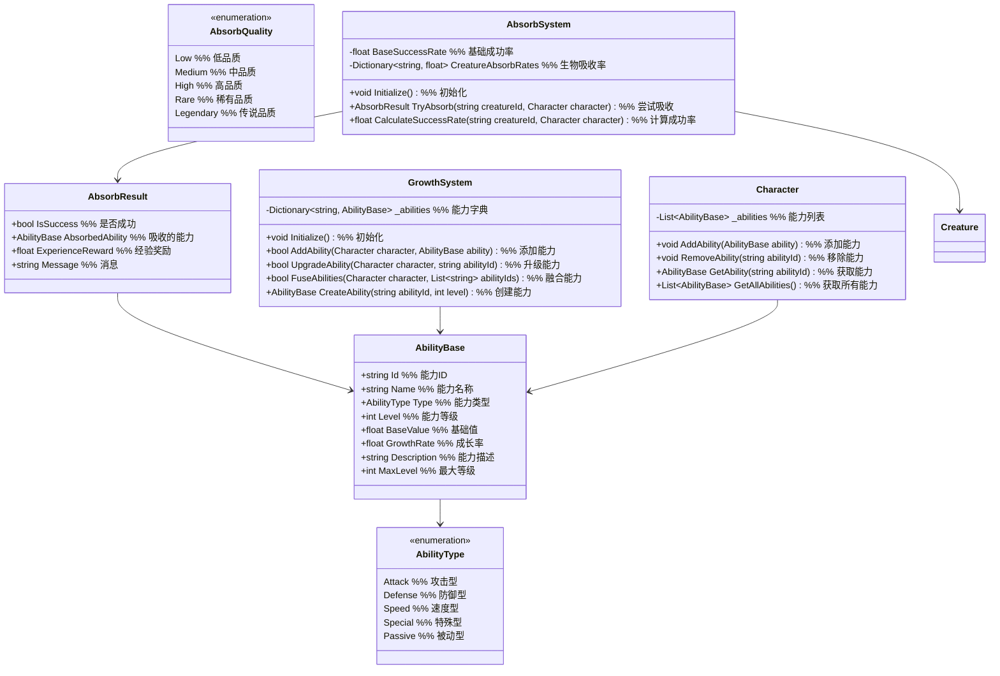

# 一期核心成长系统设计

## 1. 功能项概述与用例场景

核心成长系统是游戏的核心玩法机制，负责实现击败生物获取能力的核心玩法，以及能力融合和成长机制。本系统一期实现以下核心功能：

| 功能项         | 描述                                                         | 实际游戏用例场景 |
|----------------|--------------------------------------------------------------|------------------|
| 基础吸收机制   | 实现击败生物获取能力的核心玩法，设计吸收过程和规则             | **场景1：击败妖兽**<br>玩家击败野狼后，有概率吸收其"锋利牙齿"能力，提升攻击<br>**场景2：吸收失败**<br>吸收过程中有概率失败，获得少量经验补偿 |
| 能力成长系统   | 设计吸收后的能力融合和成长机制，确保角色变强的爽感             | **场景1：能力升级**<br>吸收多个相同能力后，能力等级提升，效果增强<br>**场景2：能力融合**<br>特定组合的能力可以融合成更强大的复合能力 |

## 2. 系统架构图



### 架构设计用例说明

**为什么将吸收和成长系统分离？**
- **用例1：功能扩展性** - 吸收系统专注于获取能力，成长系统专注于能力培养，便于独立扩展
- **用例2：平衡调整** - 可以分别调整吸收概率和成长速度，更好地控制游戏节奏

**为什么使用品质系统？**
- **用例1：稀有度分层** - 高品质能力更难获得但效果更强，增加游戏收集乐趣
- **用例2：成长差异化** - 不同品质的能力有不同的成长曲线，提供多样化的培养路径

### 主要功能流程说明

#### 流程1：能力吸收流程

```
场景：玩家击败妖兽后尝试吸收能力

1. 战斗系统 → AbsorbSystem
   调用：TryAbsorb(creatureId, playerCharacter)
   说明：请求尝试吸收妖兽能力

2. AbsorbSystem 内部处理
   - 计算吸收成功率：CalculateSuccessRate(creatureId, playerCharacter)
   - 生成随机数判断是否成功
   - 如果成功：
     a. 从配置表获取妖兽可吸收的能力列表
     b. 根据品质权重随机选择一个能力
     c. 创建能力实例：GrowthSystem.CreateAbility(abilityId, 1)
   - 如果失败：
     a. 计算经验补偿
   - 创建吸收结果：new AbsorbResult(isSuccess, ability, expReward, message)

3. AbsorbSystem → 角色属性系统
   触发：OnAbsorbCompleted(absorbResult)
   说明：通知吸收结果

4. 如果吸收成功
   角色属性系统 → GrowthSystem
   调用：AddAbility(playerCharacter, absorbedAbility)
   说明：添加能力到角色

5. 结果反馈
   UI系统 → 玩家
   显示：吸收成功/失败消息，获得的能力/经验
```

#### 流程2：能力升级流程

```
场景：玩家吸收多个相同能力后升级能力

1. GrowthSystem → Character
   调用：GetAbility(abilityId)
   说明：获取角色当前能力

2. GrowthSystem 内部处理
   - 检查能力是否存在
   - 检查能力是否可升级（未达到最大等级）
   - 计算升级所需的吸收次数
   - 消耗吸收次数计数
   - 更新能力等级和效果
   - 触发能力升级事件

3. GrowthSystem → 角色属性系统
   触发：OnAbilityUpgraded(abilityId, newLevel, oldLevel)
   说明：通知能力升级

4. UI系统 → 玩家
   显示：能力升级消息，新效果说明
```

## 3. 数据结构设计

### 3.1 能力类型枚举

```csharp
public enum AbilityType
{
    // 攻击型能力
    Attack,
    // 防御型能力
    Defense,
    // 速度型能力
    Speed,
    // 特殊能力
    Special,
    // 被动能力
    Passive
}

public enum AbsorbQuality
{
    // 低品质
    Low,
    // 中品质
    Medium,
    // 高品质
    High,
    // 稀有品质
    Rare,
    // 传说品质
    Legendary
}
```

### 3.2 能力基础结构

```csharp
public class AbilityBase
{
    public string Id { get; set; }
    public string Name { get; set; }
    public AbilityType Type { get; set; }
    public int Level { get; set; }
    public float BaseValue { get; set; }
    public float GrowthRate { get; set; }
    public string Description { get; set; }
    public int MaxLevel { get; set; }
    public AbsorbQuality Quality { get; set; }

    // 计算当前效果值
    public float GetCurrentValue()
    {
        return BaseValue + (Level - 1) * GrowthRate;
    }
}
```

### 3.3 吸收结果结构

```csharp
public class AbsorbResult
{
    public bool IsSuccess { get; set; }
    public AbilityBase AbsorbedAbility { get; set; }
    public float ExperienceReward { get; set; }
    public string Message { get; set; }
}
```

## 4. 接口设计与用例场景

### 4.1 吸收系统接口

```csharp
public interface IAbsorbSystem
{
    // 初始化吸收系统
    void Initialize();

    // 尝试吸收能力
    AbsorbResult TryAbsorb(string creatureId, Character character);

    // 计算吸收成功率
    float CalculateSuccessRate(string creatureId, Character character);

    // 设置基础成功率
    void SetBaseSuccessRate(float rate);

    // 获取生物可吸收能力列表
    List<string> GetCreatureAbilities(string creatureId);
}
```

### 4.2 成长系统接口

```csharp
public interface IGrowthSystem
{
    // 初始化成长系统
    void Initialize();

    // 添加能力
    bool AddAbility(Character character, AbilityBase ability);

    // 升级能力
    bool UpgradeAbility(Character character, string abilityId);

    // 融合能力
    bool FuseAbilities(Character character, List<string> abilityIds);

    // 创建能力实例
    AbilityBase CreateAbility(string abilityId, int level);

    // 获取能力模板
    AbilityBase GetAbilityTemplate(string abilityId);
}
```

## 5. 实现细节

### 5.1 配置表设计

为了提高系统的灵活性和可维护性，一期实现以下配置表：

#### 5.1.1 能力配置表 (AbilityConfig.csv)

| 字段名        | 类型   | 描述                          | 示例值                     |
|---------------|--------|-------------------------------|----------------------------|
| AbilityId     | string | 能力唯一标识                  | sharp_teeth, tough_skin    |
| AbilityName   | string | 能力名称                      | 锋利牙齿, 坚韧皮肤         |
| AbilityType   | string | 能力类型 (Attack/Defense等)   | Attack, Defense            |
| BaseValue     | float  | 基础值                        | 5, 3                       |
| GrowthRate    | float  | 成长率                        | 2, 1.5                     |
| MaxLevel      | int    | 最大等级                      | 5, 5                       |
| Quality       | string | 品质                          | Medium, Low                |
| Description   | string | 能力描述                      | 增加攻击力, 增加防御力     |

#### 5.1.2 生物吸收配置表 (CreatureAbsorbConfig.csv)

| 字段名        | 类型   | 描述                          | 示例值                     |
|---------------|--------|-------------------------------|----------------------------|
| CreatureId    | string | 生物ID                        | wolf, bear, goblin         |
| AbilityId     | string | 可吸收能力ID                  | sharp_teeth, tough_skin    |
| DropRate      | float  | 吸收概率 (0-1)                | 0.3, 0.2                   |
| MinLevel      | int    | 最小等级                      | 1, 2                       |
| MaxLevel      | int    | 最大等级                      | 3, 4                       |

#### 5.1.3 能力融合配置表 (AbilityFusionConfig.csv)

| 字段名        | 类型   | 描述                          | 示例值                     |
|---------------|--------|-------------------------------|----------------------------|
| FusionId      | string | 融合ID                        | fusion_001, fusion_002     |
| ResultAbilityId | string | 结果能力ID                   | fire_blast, steel_skin     |
| RequiredAbility1 | string | 所需能力1 ID                 | fire_ball, tough_skin      |
| RequiredAbility2 | string | 所需能力2 ID                 | blast_wave, metal_absorb   |
| RequiredLevel | int    | 所需能力等级                  | 3, 4                       |
```