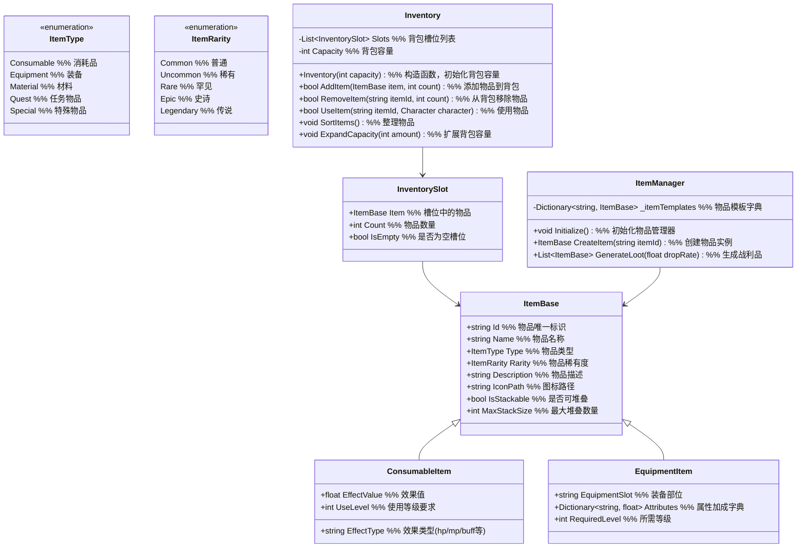

# 一期物品与背包系统设计

## 1. 功能项概述与用例场景

物品与背包系统负责管理游戏中的物品获取、存储、使用和整理，为玩家提供成长和战斗的支持。本系统一期实现以下核心功能：

| 功能项         | 描述                                                         | 实际游戏用例场景 |
|----------------|--------------------------------------------------------------|------------------|
| 物品获取机制   | 实现通过探索、战斗、任务等方式获取物品                         | **场景1：战斗奖励**<br>击败敌人后掉落装备和道具，自动进入背包<br>**场景2：任务奖励**<br>完成主线任务"击败山匪"后获得"精钢剑" |
| 物品使用机制   | 设计消耗品、装备等物品的使用规则和效果                         | **场景1：使用药品**<br>战斗中点击"金疮药"恢复50点气血<br>**场景2：装备武器**<br>打开背包点击"铁剑"装备到角色身上，提升攻击力 |
| 存储管理机制   | 实现背包空间管理、物品分类和整理功能                           | **场景1：背包满**<br>背包空间不足时提示玩家整理或扩展背包<br>**场景2：物品分类**<br>通过标签筛选功能快速找到药品、装备等不同类型物品 |

## 2. 系统架构图



### 架构设计用例说明

**为什么使用继承设计物品类型？**
- **用例1：物品多样化** - 消耗品和装备有不同的属性和行为，继承允许我们共享基础属性同时扩展特定功能
- **用例2：功能扩展** - 未来添加新物品类型（如宝石、符文）时，只需继承ItemBase并添加新特性

**为什么物品模板和实例分离？**
- **用例1：内存优化** - 所有相同物品共享一个模板，只存储实例特定数据（如数量、强化等级）
- **用例2：动态生成** - 通过模板ID可以快速创建物品实例，方便掉落和奖励系统使用

### 主要功能流程说明

#### 流程1：物品获取流程

```
场景：玩家击败敌人获得物品

1. 战斗系统 → ItemManager
   调用：GenerateLoot(enemyDropRate)
   说明：传入敌人掉落率生成战利品

2. ItemManager 内部处理
   - 根据掉落率和物品稀有度生成随机物品列表
   - 为每个物品创建实例：CreateItem(itemId)
   - 返回物品列表

3. 战斗系统 → Inventory
   调用：AddItem(item, count)
   说明：将战利品添加到玩家背包

4. Inventory 内部处理
   - 检查背包空间
   - 查找相同物品的堆叠槽位
   - 如果找到：增加数量
   - 如果未找到：寻找空槽位添加
   - 如果没有空间：返回添加失败

5. 事件通知
   Inventory → UI系统
   触发：OnItemAdded(item, count)
   说明：通知UI更新背包显示
```

#### 流程2：物品使用流程

```
场景：玩家使用恢复药品

1. UI系统 → Inventory
   调用：UseItem(itemId, attributeManager)
   说明：传递使用物品指令和属性管理器接口

2. Inventory 内部处理
   - 检查物品是否存在
   - 检查物品类型是否可使用
   - 检查使用条件（如等级要求）
   - 如果满足条件：减少物品数量
   - 如果物品数量为0：移除物品槽位
   - 调用 ApplyItemEffect(item, attributeManager)

3. Inventory 内部方法
   调用：ApplyItemEffect(item, attributeManager)
   说明：应用物品效果到角色

4. 效果应用处理
   - 如果是消耗品：
     - 根据EffectType和EffectValue更新对应属性
     - 如：attributeManager.AddAttribute("hp", 50)
   - 如果是装备：
     - 遍历AttributeBonuses列表
     - 对每个属性加成：attributeManager.AddAttribute(bonus.AttributeId, bonus.BonusValue, bonus.AttributeType)

5. 事件通知
   Inventory → UI系统
   触发：OnItemUsed(itemId, count)
   说明：通知UI更新背包和角色状态显示
```

## 3. 数据结构设计

### 3.1 物品类型枚举

```csharp
public enum ItemType
{
    // 消耗品
    Consumable,
    // 装备
    Equipment,
    // 材料
    Material,
    // 任务物品
    Quest,
    // 特殊物品
    Special
}

public enum ItemRarity
{
    // 普通
    Common,
    // 稀有
    Uncommon,
    // 罕见
    Rare,
    // 史诗
    Epic,
    // 传说
    Legendary
}
```

### 3.2 物品基础结构

```csharp
public class ItemBase
{
    public string Id { get; set; }
    public string Name { get; set; }
    public ItemType Type { get; set; }
    public ItemRarity Rarity { get; set; }
    public string Description { get; set; }
    public string IconPath { get; set; }
    public bool IsStackable { get; set; }
    public int MaxStackSize { get; set; }
}
```

### 3.3 消耗品结构

```csharp
public class ConsumableItem : ItemBase
{
    public float EffectValue { get; set; }
    public string EffectType { get; set; }
    public int UseLevel { get; set; }
}
```

### 3.4 装备结构

```csharp
public class EquipmentItem : ItemBase
{
    public string EquipmentSlot { get; set; }
    public List<AttributeBonus> AttributeBonuses { get; set; }
    public int RequiredLevel { get; set; }
}

public class AttributeBonus
{
    public string AttributeId { get; set; }
    public float BonusValue { get; set; }
    public AttributeType AttributeType { get; set; }
}
```

### 3.5 背包和槽位结构

```csharp
public class InventorySlot
{
    public ItemBase Item { get; set; }
    public int Count { get; set; }
    public bool IsEmpty => Item == null || Count <= 0;
}

public class Inventory
{
    private List<InventorySlot> _slots;
    private int _capacity;

    public Inventory(int capacity)
    {
        _capacity = capacity;
        _slots = new List<InventorySlot>(capacity);
        for (int i = 0; i < capacity; i++)
        {
            _slots.Add(new InventorySlot());
        }
    }

    // 方法实现...
}
```

## 4. 接口设计与用例场景

### 4.1 物品管理器接口

```csharp
public interface IItemManager
{
    // 初始化物品系统
    void Initialize();

    // 创建物品实例
    ItemBase CreateItem(string itemId);

    // 生成战利品
    List<ItemBase> GenerateLoot(float dropRate);

    // 获取物品模板
    ItemBase GetItemTemplate(string itemId);

    // 获取所有物品模板
    Dictionary<string, ItemBase> GetAllItemTemplates();
}
```

### 4.2 背包接口

```csharp
public interface IInventory
{
    // 添加物品
    bool AddItem(ItemBase item, int count);

    // 移除物品
    bool RemoveItem(string itemId, int count);

    // 使用物品
    bool UseItem(string itemId, IAttributeManager attributeManager);

    // 应用物品效果
    void ApplyItemEffect(ItemBase item, IAttributeManager attributeManager);

    // 整理物品
    void SortItems();

    // 扩展容量
    void ExpandCapacity(int amount);

    // 获取槽位列表
    List<InventorySlot> GetSlots();

    // 获取背包容量
    int GetCapacity();

    // 检查物品是否存在
    bool HasItem(string itemId, int count = 1);
}
```

## 5. 实现细节

### 5.1 配置表设计

为了提高系统的灵活性和可维护性，一期实现以下配置表：

#### 5.1.1 物品基础配置表 (ItemConfig.csv)

| 字段名        | 类型   | 描述                          | 示例值                     |
|---------------|--------|-------------------------------|----------------------------|
| ItemId        | string | 物品唯一标识                  | potion_hp_small, sword_iron |
| ItemName      | string | 物品名称                      | 小型金疮药, 铁剑          |
| ItemType      | string | 物品类型 (Consumable/Equipment等) | Consumable, Equipment       |
| ItemRarity    | string | 物品稀有度                    | Common, Uncommon           |
| Description   | string | 物品描述                      | 恢复少量气血, 基础铁剑     |
| IconPath      | string | 图标路径                      | ui/icons/potion.png        |
| IsStackable   | bool   | 是否可堆叠                    | true, false                |
| MaxStackSize  | int    | 最大堆叠数量                  | 20, 1                      |

#### 5.1.2 消耗品配置表 (ConsumableConfig.csv)

| 字段名        | 类型   | 描述                          | 示例值                     |
|---------------|--------|-------------------------------|----------------------------|
| ItemId        | string | 物品唯一标识                  | potion_hp_small, potion_mp_small |
| EffectValue   | float  | 效果值                        | 50, 30                     |
| EffectType    | string | 效果类型 (hp/mp/buff等)       | hp, mp                     |
| UseLevel      | int    | 使用等级要求                  | 1, 1                       |

#### 5.1.3 装备配置表 (EquipmentConfig.csv)

| 字段名        | 类型   | 描述                          | 示例值                     |
|---------------|--------|-------------------------------|----------------------------|
| ItemId        | string | 物品唯一标识                  | sword_iron, armor_cloth    |
| EquipmentSlot | string | 装备部位                      | weapon, body               |
| HpBonus       | float  | 气血加成                      | 0, 20                      |
| MpBonus       | float  | 法力加成                      | 0, 10                      |
| AttackBonus   | float  | 攻击加成                      | 10, 0                      |
| DefenseBonus  | float  | 防御加成                      | 0, 5                       |
| SpeedBonus    | float  | 速度加成                      | 0, 2                       |
| RequiredLevel | int    | 所需等级                      | 1, 1                       |

#### 5.1.4 掉落配置表 (LootConfig.csv)

| 字段名        | 类型   | 描述                          | 示例值                     |
|---------------|--------|-------------------------------|----------------------------|
| EnemyId       | string | 敌人ID                        | enemy_goblin, enemy_orc    |
| ItemId        | string | 掉落物品ID                    | potion_hp_small, sword_iron |
| DropRate      | float  | 掉落概率 (0-1)                | 0.3, 0.1                   |
| MinCount      | int    | 最小掉落数量                  | 1, 1                       |
| MaxCount      | int    | 最大掉落数量                  | 2, 1                       |
```