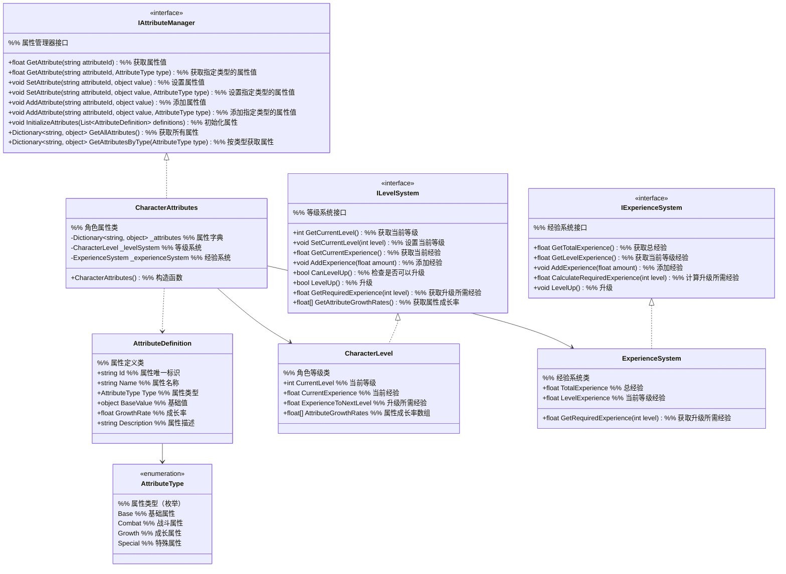

# 一期角色属性系统设计

## 1. 功能项概述与用例场景

角色属性系统负责管理玩家角色的核心属性、等级成长和经验机制，为游戏其他系统提供基础数据支持。本系统一期实现以下核心功能：

| 功能项         | 描述                                                         | 实际游戏用例场景 |
|----------------|--------------------------------------------------------------|------------------|
| 基本属性管理   | 管理玩家角色的核心属性，包括等级、气血、法力等基础属性       | **场景1：战斗伤害计算**<br>玩家攻击敌人时，战斗系统需要读取`attack`属性计算基础伤害，读取`defense`属性计算减伤效果<br>**场景2：技能释放判定**<br>释放火球术需要检查当前`mp`是否≥30点法力 |
| 等级体系       | 实现从初级到中级的等级进阶机制，每个等级有不同的属性成长曲线 | **场景1：境界突破**<br>玩家从炼气期1层突破到2层时，系统根据等级自动提升气血上限+20，法力上限+10<br>**场景2：装备解锁**<br>玩家达到5级时解锁青铜剑装备，15级解锁白银剑装备 |
| 经验成长机制   | 设计经验获取和升级规则，确保角色成长节奏合理                 | **场景1：击败妖兽**<br>击败1级野狼获得10经验，击败5级虎妖获得50经验<br>**场景2：任务完成**<br>完成"采集灵草"任务获得100经验，经验满后自动升级 |

## 2. 系统架构图



### 架构设计用例说明

**为什么使用接口设计？**
- **用例1：战斗系统调用** - 战斗系统只需要知道`IAttributeManager`接口，不需要关心具体实现。当玩家从炼气期升级到筑基期时，战斗系统无需修改代码
- **用例2：存档系统兼容** - 存档系统通过接口保存属性数据，未来即使更换属性存储方式（如从内存改为数据库），其他系统不受影响

**为什么使用枚举分类？**
- **用例1：UI筛选显示** - 角色面板只显示`Combat`类型属性（攻击、防御），隐藏内部使用的`Growth`类型属性（等级成长率）
- **用例2：平衡调整** - 游戏策划可以通过配置文件只调整`Combat`类属性的成长率，不影响其他属性类型

**为什么分离等级和经验系统？**
- **用例1：双倍经验活动** - 活动期间只修改`ExperienceSystem`的经验获取倍率，等级成长逻辑保持不变
- **用例2：境界压制** - 高等级玩家击杀低级怪物时，`ExperienceSystem`可以返回0经验，而等级系统仍然正常工作

### 主要功能流程说明

#### 流程1：角色升级完整流程

```
场景：玩家击败怪物获得经验，触发升级

1. 战斗系统 → ExperienceSystem
   调用：_experienceSystem.AddExperience(50)
   说明：战斗系统传入击败怪物获得的经验值

2. ExperienceSystem 内部处理
   - 更新 TotalExperience += 50
   - 更新 LevelExperience += 50
   - 检查：if(LevelExperience >= GetRequiredExperience(CurrentLevel))

3. ExperienceSystem → CharacterLevel
   调用：_levelSystem.LevelUp()
   说明：经验达到升级要求，触发等级提升

4. CharacterLevel 内部处理
   - CurrentLevel += 1
   - 根据等级计算新属性成长率
   - 重置 LevelExperience = 0

5. CharacterLevel → CharacterAttributes
   调用：UpdateAttributesByLevel(newLevel)
   说明：根据新等级更新所有相关属性

6. CharacterAttributes 内部处理
   - 遍历 AttributeDefinition 列表
   - 对每个属性：新值 = 基础值 + (新等级 × 成长率)
   - 更新 _attributes 字典中的值

7. 事件通知
   CharacterAttributes → 外部系统
   触发：OnLevelUp(newLevel, newAttributes)
   说明：通知UI系统刷新角色面板，通知存档系统保存数据
```

#### 流程2：属性查询与计算流程

```
场景：战斗系统需要计算玩家攻击力

1. 战斗系统 → IAttributeManager
   调用：GetAttribute("attack", AttributeType.Combat)

2. CharacterAttributes 内部处理
   - 检查缓存：_attributes.TryGetValue("attack", out value)
   - 如果找到：直接返回 value
   - 如果未找到：
     - 查找 AttributeDefinition 中 attack 的定义
     - 根据当前等级计算：value = BaseValue + (CurrentLevel × GrowthRate)
     - 缓存到 _attributes
     - 返回计算结果

3. 战斗系统接收结果
   - 获得最终攻击力数值
   - 用于伤害计算公式
```

#### 流程3：装备属性附加流程

```
场景：玩家装备青铜剑，需要增加攻击力

1. 装备系统 → IAttributeManager
   调用：AddAttribute("attack", 15, AttributeType.Combat)

2. CharacterAttributes 内部处理
   - 检查 _attributes 中是否已存在 attack
   - 如果存在：新值 = 原值 + 15
   - 如果不存在：新值 = 基础值 + 15
   - 更新 _attributes["attack"] = 新值

3. 属性变更事件
   CharacterAttributes → 外部系统
   触发：OnAttributeChanged("attack", oldValue, newValue)
   说明：通知战斗系统更新战斗力，通知UI刷新角色面板

4. 装备卸下时
   装备系统 → IAttributeManager
   调用：AddAttribute("attack", -15, AttributeType.Combat)
   说明：通过减少数值实现装备卸下效果
```

#### 流程4：存档数据恢复流程

```
场景：游戏加载时恢复角色数据

1. 存档系统 → CharacterAttributes
   调用：InitializeAttributes(savedDefinitions)
   说明：传入从存档读取的属性定义列表

2. CharacterAttributes 内部处理
   - 清空 _attributes 字典
   - 遍历 savedDefinitions
   - 对每个属性：
     - 根据当前等级重新计算属性值
     - 存入 _attributes 字典

3. 存档系统 → CharacterLevel
   调用：SetCurrentLevel(savedLevel)
   说明：设置从存档读取的等级

4. CharacterLevel 内部处理
   - 设置 CurrentLevel = savedLevel
   - 根据等级重新计算所有属性成长率
   - 触发属性更新事件

5. 系统初始化完成
   CharacterAttributes → 外部系统
   触发：OnSystemInitialized()
   说明：通知所有系统角色数据已就绪
```

## 2. 数据结构设计

### 2.1 属性分类

为了提高系统的扩展性，将属性分为以下几类：

```csharp
public enum AttributeType
{
    // 基础属性
    Base,
    // 战斗属性
    Combat,
    // 成长属性
    Growth,
    // 特殊属性
    Special
}
```

### 2.2 属性定义结构

```csharp
[Serializable]
public class AttributeDefinition
{
    public string Id;              // 属性唯一标识
    public string Name;            // 属性名称
    public AttributeType Type;     // 属性类型
    public object BaseValue;       // 基础值（支持多种数据类型）
    public float GrowthRate;       // 成长率
    public string Description;     // 属性描述
}
```

### 2.3 角色属性数据结构

```csharp
public class CharacterAttributes
{
    private Dictionary<string, object> _attributes;  // 当前属性值（支持多种数据类型）
    private CharacterLevel _levelSystem;            // 等级系统
    private ExperienceSystem _experienceSystem;     // 经验系统

    // 构造函数
    public CharacterAttributes()
    {
        _attributes = new Dictionary<string, object>();
        _levelSystem = new CharacterLevel();
        _experienceSystem = new ExperienceSystem();
    }

    // 属性相关方法将在接口设计中定义
}
```

### 2.4 等级和经验数据结构

```csharp
public class CharacterLevel
{
    public int CurrentLevel { get; private set; }
    public float CurrentExperience { get; private set; }
    public float ExperienceToNextLevel { get; private set; }
    public float[] AttributeGrowthRates { get; private set; }  // 各属性成长率
}

public class ExperienceSystem
{
    public float TotalExperience { get; private set; }
    public float LevelExperience { get; private set; }
    public delegate float ExperienceFormula(int level);
    public ExperienceFormula GetRequiredExperience { get; set; }  // 可配置的经验计算公式
    
    public ExperienceSystem()
    {
        // 默认经验公式
        GetRequiredExperience = level => level * 100 + 50;
    }
}
```

## 3. 接口设计与用例场景

### 3.1 属性管理接口

```csharp
public interface IAttributeManager
{
    // 获取属性值
    object GetAttribute(string attributeId);
    object GetAttribute(string attributeId, AttributeType type);

    // 设置属性值
    void SetAttribute(string attributeId, object value);
    void SetAttribute(string attributeId, object value, AttributeType type);

    // 添加属性值
    void AddAttribute(string attributeId, object value);
    void AddAttribute(string attributeId, object value, AttributeType type);

    // 初始化属性
    void InitializeAttributes(List<AttributeDefinition> definitions);

    // 获取所有属性
    Dictionary<string, object> GetAllAttributes();
    Dictionary<string, object> GetAttributesByType(AttributeType type);
}
```

#### 接口设计用例场景

**为什么使用object类型支持多种数据？**
- **用例1：装备属性** - 装备系统需要存储字符串类型的"品质"（"普通"/"精良"/"史诗"），而不仅是数值
- **用例2：状态效果** - 中毒状态需要存储bool类型的"是否中毒"，以及float类型的"中毒持续时间"

**为什么提供AddAttribute方法？**
- **用例1：buff叠加** - 使用"力量药剂"时，调用`AddAttribute("attack", 5)`临时增加5点攻击，而不是直接设置
- **用例2：伤害计算** - 受到攻击时，调用`AddAttribute("hp", -20)`减少20点气血，避免手动计算新值

**为什么使用string作为属性ID？**
- **用例1：动态属性** - 游戏策划可以添加新属性"暴击率"，无需修改枚举定义，直接通过字符串"crit_rate"访问
- **用例2：国际化** - 中文环境下显示"气血"，英文环境下显示"Health"，但内部统一使用"hp"作为ID

### 3.2 等级系统接口

```csharp
public interface ILevelSystem
{
    // 获取当前等级
    int GetCurrentLevel();

    // 设置当前等级
    void SetCurrentLevel(int currentLevel);

    // 获取当前经验
    float GetCurrentExperience();

    // 添加经验
    void AddExperience(float amount);

    // 检查是否可以升级
    bool CanLevelUp();

    // 升级
    bool LevelUp();

    // 获取升级所需经验
    float GetRequiredExperience(int level);

    // 获取属性成长率
    float[] GetAttributeGrowthRates();
}
```

### 3.3 经验系统接口

```csharp
public interface IExperienceSystem
{
    // 获取总经验
    float GetTotalExperience();

    // 获取当前等级经验
    float GetLevelExperience();

    // 添加经验
    void AddExperience(float amount);

    // 计算升级所需经验
    float CalculateRequiredExperience(int level);

    // 升级
    void LevelUp();
}
```

## 4. 模块交互

角色属性系统作为游戏的核心系统之一，需要与多个其他模块进行交互。以下是与主要模块的交互方式和数据传输说明：

### 4.1 与战斗系统的交互
- **数据传输方向**：角色属性系统 → 战斗系统
- **传输数据**：攻击、防御、气血、法力等战斗属性值
- **通信方式**：直接调用接口
- **具体场景**：
  - 战斗开始前，战斗系统通过`IAttributeManager.GetAttribute("attack")`获取玩家攻击力
  - 受到伤害时，战斗系统通过`IAttributeManager.AddAttribute("hp", -damage)`减少玩家气血
  - 战斗结束后，战斗系统通知经验系统添加经验：`IExperienceSystem.AddExperience(expReward)`

### 4.2 与装备系统的交互
- **数据传输方向**：装备系统 → 角色属性系统
- **传输数据**：装备附加属性值（如+15攻击、+10防御）
- **通信方式**：事件通知 + 接口调用
- **具体场景**：
  - 装备穿戴时，装备系统触发`OnEquipmentEquipped`事件，属性系统监听并调用`AddAttribute`添加属性
  - 装备卸下时，装备系统触发`OnEquipmentUnequipped`事件，属性系统监听并调用`AddAttribute`减去属性
  - 更换装备时，先卸下旧装备（减去属性），再穿戴新装备（添加属性）

### 4.3 与存档系统的交互
- **数据传输方向**：双向
- **传输数据**：角色等级、经验、属性值等
- **通信方式**：接口调用 + 数据共享
- **具体场景**：
  - 存档时，存档系统通过`IAttributeManager.GetAllAttributes()`获取所有属性
  - 读档时，存档系统调用`IAttributeManager.InitializeAttributes(savedAttributes)`恢复属性
  - 存档系统通过`ILevelSystem.GetCurrentLevel()`获取当前等级

### 4.4 与UI系统的交互
- **数据传输方向**：角色属性系统 → UI系统
- **传输数据**：属性值变化、等级提升事件
- **通信方式**：事件通知
- **具体场景**：
  - 属性变化时，触发`OnAttributeChanged`事件，UI系统更新角色面板
  - 等级提升时，触发`OnLevelUp`事件，UI系统显示升级特效和新属性
  - UI系统通过`IAttributeManager.GetAttributesByType(AttributeType.Combat)`获取战斗属性用于显示

### 4.5 与核心成长系统的交互
- **数据传输方向**：核心成长系统 → 角色属性系统
- **传输数据**：属性加成、成长率调整
- **通信方式**：接口调用
- **具体场景**：
  - 学习技能时，核心成长系统调用`AddAttribute`增加相关属性
  - 突破境界时，核心成长系统调用`SetAttribute`重置属性成长率
  - 核心成长系统通过`GetAttribute`检查属性条件是否满足成长要求

## 5. 实现细节

### 5.1 配置表设计

为了提高系统的灵活性和可维护性，一期实现以下配置表：

#### 4.1.1 属性配置表 (AttributeConfig.csv)

| 字段名        | 类型   | 描述                          | 示例值                     |
|---------------|--------|-------------------------------|----------------------------|
| AttributeId   | string | 属性唯一标识                  | hp, mp, attack             |
| AttributeName | string | 属性显示名称                  | 气血, 法力, 攻击          |
| AttributeType | string | 属性类型 (Base/Combat/Growth) | Base, Combat, Growth       |
| BaseValue     | float  | 基础值                        | 100, 50, 10                |
| GrowthRate    | float  | 成长率                        | 20, 10, 2                  |
| Description   | string | 属性描述                      | 角色当前生命值, 角色基础攻击力 |
| IconPath      | string | 图标路径                      | ui/icons/hp.png            |
| SortOrder     | int    | 排序顺序                      | 1, 2, 3                    |

#### 4.1.2 等级配置表 (LevelConfig.csv)

| 字段名              | 类型   | 描述                          | 示例值                     |
|---------------------|--------|-------------------------------|----------------------------|
| Level               | int    | 等级                          | 1, 2, 3                    |
| ExpToNextLevel      | float  | 升级所需经验                  | 150, 250, 350              |
| HpGrowthBonus       | float  | 气血成长加成                  | 0, 2, 4                    |
| MpGrowthBonus       | float  | 法力成长加成                  | 0, 1, 2                    |
| AttackGrowthBonus   | float  | 攻击成长加成                  | 0, 0.5, 1                  |
| DefenseGrowthBonus  | float  | 防御成长加成                  | 0, 0.3, 0.6                |
| SpeedGrowthBonus    | float  | 速度成长加成                  | 0, 0.2, 0.4                |
| UnlockFeature       | string | 解锁功能                      | 新手引导, 装备系统, 技能系统 |

#### 4.1.3 经验配置表 (ExperienceConfig.csv)

| 字段名               | 类型   | 描述                          | 示例值                     |
|----------------------|--------|-------------------------------|----------------------------|
| EnemyLevel           | int    | 敌人等级                      | 1, 2, 3                    |
| EnemyBaseExp         | float  | 基础经验值                    | 10, 20, 30                 |
| TaskId               | string | 任务ID                        | task_1001, task_1002       |
| TaskBaseExp          | float  | 任务基础经验                  | 100, 200                   |
| ExploreId            | string | 探索点ID                      | explore_001, explore_002   |
| ExploreExp           | float  | 探索经验值                    | 50, 100                    |
| DifficultyCoefficient| float | 难度系数                      | 1.0, 1.5, 2.0              |

### 4.1.4 配置表加载与使用示例

以下是配置表加载和使用的C#代码示例：

```csharp
// 配置表管理器
public class ConfigManager
{
    private static ConfigManager _instance;
    public static ConfigManager Instance
    {
        get
        {
            if (_instance == null)
                _instance = new ConfigManager();
            return _instance;
        }
    }

    // 存储配置表数据
    private Dictionary<string, AttributeConfig> _attributeConfigs;
    private Dictionary<int, LevelConfig> _levelConfigs;
    private Dictionary<int, EnemyExpConfig> _enemyExpConfigs;
    private Dictionary<string, TaskExpConfig> _taskExpConfigs;
    private Dictionary<string, ExploreExpConfig> _exploreExpConfigs;

    // 初始化加载所有配置表
    public void Initialize()
    {
        LoadAttributeConfig();
        LoadLevelConfig();
        LoadExperienceConfig();
    }

    // 加载属性配置表
    private void LoadAttributeConfig()
    {
        _attributeConfigs = new Dictionary<string, AttributeConfig>();
        // 实际项目中从CSV或JSON文件加载
        // 这里为示例直接添加数据
        _attributeConfigs.Add("hp", new AttributeConfig
        {
            AttributeId = "hp",
            AttributeName = "气血",
            AttributeType = AttributeType.Base,
            BaseValue = 100,
            GrowthRate = 20,
            Description = "角色当前生命值",
            IconPath = "ui/icons/hp.png",
            SortOrder = 1
        });

        // 加载其他属性...
    }

    // 加载等级配置表
    private void LoadLevelConfig()
    {
        _levelConfigs = new Dictionary<int, LevelConfig>();
        // 实际项目中从CSV或JSON文件加载
        // 这里为示例直接添加数据
        _levelConfigs.Add(1, new LevelConfig
        {
            Level = 1,
            ExpToNextLevel = 150,
            HpGrowthBonus = 0,
            MpGrowthBonus = 0,
            AttackGrowthBonus = 0,
            DefenseGrowthBonus = 0,
            SpeedGrowthBonus = 0,
            UnlockFeature = "新手引导"
        });

        // 加载其他等级...
    }

    // 加载经验配置表
    private void LoadExperienceConfig()
    {
        _enemyExpConfigs = new Dictionary<int, EnemyExpConfig>();
        _taskExpConfigs = new Dictionary<string, TaskExpConfig>();
        _exploreExpConfigs = new Dictionary<string, ExploreExpConfig>();

        // 实际项目中从CSV或JSON文件加载
        // 这里为示例直接添加数据
        _enemyExpConfigs.Add(1, new EnemyExpConfig
        {
            EnemyLevel = 1,
            EnemyBaseExp = 10,
            DifficultyCoefficient = 1.0f
        });

        // 加载其他经验配置...
    }

    // 获取属性配置
    public AttributeConfig GetAttributeConfig(string attributeId)
    {
        if (_attributeConfigs.TryGetValue(attributeId, out var config))
            return config;
        return null;
    }

    // 获取等级配置
    public LevelConfig GetLevelConfig(int level)
    {
        if (_levelConfigs.TryGetValue(level, out var config))
            return config;
        return null;
    }

    // 获取敌人经验配置
    public EnemyExpConfig GetEnemyExpConfig(int enemyLevel)
    {
        if (_enemyExpConfigs.TryGetValue(enemyLevel, out var config))
            return config;
        return null;
    }

    // 其他获取配置方法...
}

// 属性配置类
public class AttributeConfig
{
    public string AttributeId { get; set; }
    public string AttributeName { get; set; }
    public AttributeType AttributeType { get; set; }
    public float BaseValue { get; set; }
    public float GrowthRate { get; set; }
    public string Description { get; set; }
    public string IconPath { get; set; }
    public int SortOrder { get; set; }
}

// 等级配置类
public class LevelConfig
{
    public int Level { get; set; }
    public float ExpToNextLevel { get; set; }
    public float HpGrowthBonus { get; set; }
    public float MpGrowthBonus { get; set; }
    public float AttackGrowthBonus { get; set; }
    public float DefenseGrowthBonus { get; set; }
    public float SpeedGrowthBonus { get; set; }
    public string UnlockFeature { get; set; }
}

// 敌人经验配置类
public class EnemyExpConfig
{
    public int EnemyLevel { get; set; }
    public float EnemyBaseExp { get; set; }
    public float DifficultyCoefficient { get; set; }
}

// 使用示例
public class CharacterSystem
{
    private CharacterAttributes _attributes;

    public void Initialize()
    {
        _attributes = new CharacterAttributes();
        LoadCharacterAttributes();
    }

    private void LoadCharacterAttributes()
    {
        // 从配置表加载属性定义
        var configManager = ConfigManager.Instance;
        var attributeConfigs = configManager.GetAllAttributeConfigs();

        List<AttributeDefinition> definitions = new List<AttributeDefinition>();
        foreach (var config in attributeConfigs.Values)
        {
            definitions.Add(new AttributeDefinition
            {
                Id = config.AttributeId,
                Name = config.AttributeName,
                Type = config.AttributeType,
                BaseValue = config.BaseValue,
                GrowthRate = config.GrowthRate,
                Description = config.Description
            });
        }

        // 初始化角色属性
        _attributes.InitializeAttributes(definitions);
    }
}
```

### 4.2 基本属性管理实现

一期实现以下基本属性（对应属性配置表）：

| 属性ID    | 属性名称 | 属性类型 | 基础值 | 成长率 | 描述                     |
|-----------|----------|----------|--------|--------|--------------------------|
| level     | 等级     | Growth   | 1      | 0      | 角色当前等级             |
| hp        | 气血     | Base     | 100    | 20     | 角色当前生命值           |
| mp        | 法力     | Base     | 50     | 10     | 角色当前魔法值           |
| attack    | 攻击     | Combat   | 10     | 2      | 角色基础攻击力           |
| defense   | 防御     | Combat   | 5      | 1      | 角色基础防御力           |
| speed     | 速度     | Combat   | 8      | 1      | 角色行动速度             |

### 4.2 等级体系实现

一期实现等级范围：1-20级

升级经验公式：`当前等级 * 100 + 50`

每级属性成长规则：
- 气血：每级增加 20 + (currentLevel-1)*2
- 法力：每级增加 10 + (currentLevel-1)*1
- 攻击：每级增加 2 + (currentLevel-1)*0.5
- 防御：每级增加 1 + (currentLevel-1)*0.3
- 速度：每级增加 1 + (currentLevel-1)*0.2

### 4.3 经验成长机制实现

经验获取途径：
- 击败敌人：根据敌人等级和难度获取经验
- 完成任务：根据任务难度获取经验
- 探索发现：发现新区域或完成探索目标获取经验

经验计算规则：
- 敌人经验 = enemyLevel * 10 * difficultyCoefficient
- 任务经验 = baseTaskExperience * completionQualityCoefficient
- 探索经验 = fixedExperienceValue

#### 经验机制用例场景

**为什么设置1-20级范围？**
- **用例1：新手引导期** - 1-5级为新手村阶段，玩家通过击杀1-2级野兔快速升到3级，学习基础操作
- **用例2：成长瓶颈设计** - 15-20级每级需要1500-2050经验，玩家需要完成多个任务或挑战高级怪物，延长游戏时长

**为什么使用线性成长公式？**
- **用例1：预期管理** - 玩家可以心算："我现在10级，升到11级需要1050经验，击杀10级怪物每次得100经验，大约需要11次"
- **用例2：平衡性测试** - 策划可以精确计算："从1级到20级总共需要20500经验，按每天游戏2小时计算，需要7天达到满级"

**为什么区分不同经验来源？**
- **用例1：多样化玩法** - 战斗型玩家通过刷怪升级，任务型玩家通过完成主线升级，探索型玩家通过发现隐藏区域升级
- **用例2：防刷机制** - 当玩家反复刷同一低级怪物时，`difficultyCoefficient`会逐渐降低至0.1，经验收益大幅减少

## 5. 与其他系统交互

| 交互系统       | 交互方式 | 传输数据                     |
|----------------|----------|------------------------------|
| 战斗系统       | 调用接口 | 攻击力、防御力、生命值、法力值 |
| 技能系统       | 调用接口 | 法力值、等级                 |
| 物品与背包系统 | 调用接口 | 属性加成、等级               |
| 核心成长系统   | 调用接口 | 成长属性、等级               |
| UI系统         | 事件通知 | 所有属性变更                 |
| 存档系统       | 数据持久化 | 所有属性数据、等级、经验     |

## 6. 扩展性设计与未来用例

1. **属性扩展**：通过配置表添加新属性，无需修改代码
2. **成长公式扩展**：支持通过配置文件定义不同的成长曲线，支持复杂的数学函数
3. **等级上限扩展**：通过配置文件设置最大等级
4. **多类型属性支持**：支持多种数据类型的属性（int, float, string, bool等）
5. **事件驱动**：属性变更通过事件通知其他系统，降低耦合度
6. **插件化成长系统**：支持通过插件扩展新的成长机制

### 扩展性用例场景

**属性扩展的实际应用：**
- **用例1：新增暴击系统** - 游戏更新时，策划只需在配置表中添加`crit_rate`和`crit_damage`属性，无需程序员修改代码
- **用例2：节日属性** - 春节期间添加临时属性"节日运气"，影响掉落率，节后移除配置即可

**成长公式扩展的实际应用：**
- **用例1：境界突破** - 炼气期使用线性成长，筑基期改为指数成长`level^2 * 100`，通过配置文件切换
- **用例2：VIP系统** - VIP玩家使用特殊成长公式`level * 80 + 30`，普通玩家保持原公式

**事件驱动的实际应用：**
- **用例1：成就系统** - 当"hp"属性首次降到10以下时，触发"死里逃生"成就
- **用例2：AI反应** - 当玩家"mp"低于20%时，敌人AI会优先使用法力燃烧技能