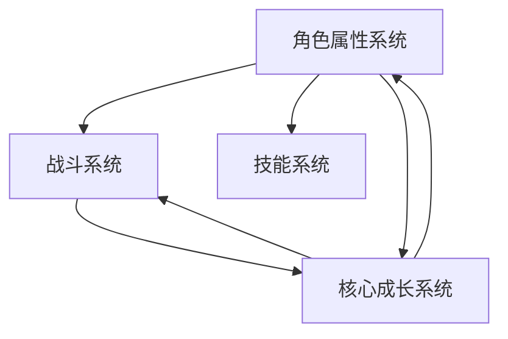
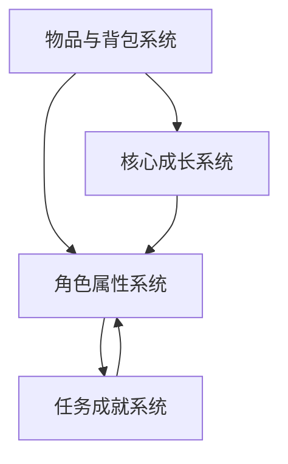
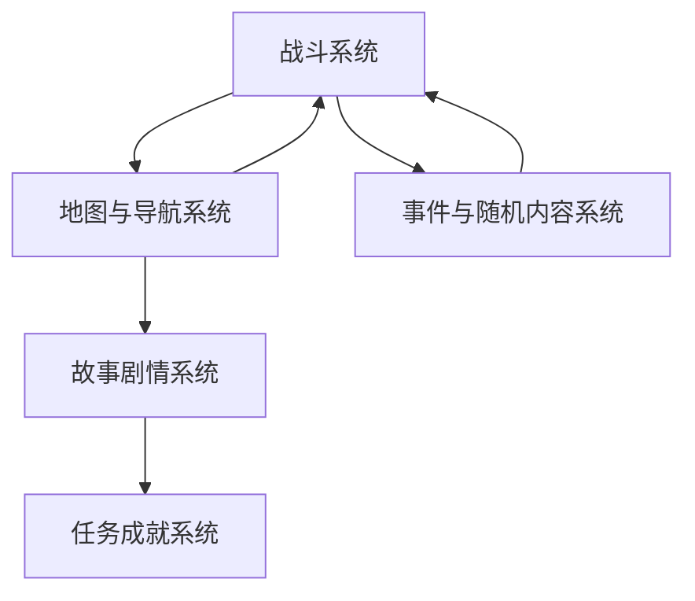
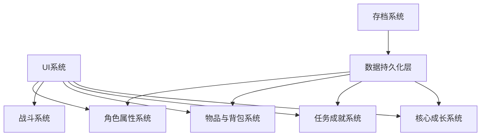

# 一期系统设计（MVP版本）

## 游戏概述
本游戏是一款玄幻题材的即时战斗冒险游戏，玩家将扮演一名修仙者，通过击败妖兽吸收其能力来不断成长，探索广阔的游戏世界。

## 系统概述
本文件描述了游戏一期（MVP版本）的系统设计，聚焦于实现核心玩法闭环。一期开发将优先实现8个核心模块，确保游戏可玩、稳定，并能够验证核心成长玩法的可行性。本版本采用即时制战斗系统，强调操作感和战斗策略性。

### 核心玩法
1. **角色成长**：通过击败妖兽吸收能力，提升角色属性和战斗力
2. **即时战斗**：实时操作角色移动、释放技能，策略性击败敌人
3. **探索解谜**：探索多样化的地图，发现隐藏资源和秘密
4. **装备收集**：获取和强化装备，提升角色能力

### 技术栈选择
- **引擎**：Godot引擎（跨平台兼容性好，轻量级，适合独立游戏开发）
- **语言**：C#（面向对象，性能优良，适合游戏逻辑开发）
- **数据持久化**：JSON（可读性好，易于调试和修改）
- **事件系统**：基于发布/订阅模式的事件总线（降低模块耦合度）

## 模块关系图
### 整体模块关系图
```mermaid
graph TD
    subgraph 核心玩法层
        A[角色属性系统]
        B[战斗系统]
        C[技能系统]
        O[核心成长系统]
    end
    
    subgraph 物品与成长层
        I[物品与背包系统]
        K[任务成就系统]
    end
    
    subgraph 世界与探索层
        F[地图与导航系统]
        H[事件与随机内容系统]
        M[故事剧情系统]
    end
    
    subgraph 基础设施层
        L[UI系统]
        N[存档系统]
        P[数据持久化层]
    end
    
    A --> B : 提供属性数据
    A --> C : 提供属性支持
    A --> O : 提供成长基础
    B --> F : 在地图中发生
    B --> H : 受随机事件触发
    B --> O : 提供成长资源
    I --> A : 影响角色属性
    I --> O : 提供成长材料
    L --> A : 显示/修改属性
    L --> B : 战斗界面交互
    L --> I : 物品界面交互
    L --> K : 任务界面交互
    L --> O : 成长界面交互
    M --> K : 推动任务发展
    M --> F : 在地图中展开
    N --> P : 数据持久化
    P --> A : 保存/加载属性
    P --> I : 保存/加载物品
    P --> K : 保存/加载任务
    P --> O : 保存/加载成长
    O --> A : 更新角色属性
    O --> B : 增强战斗能力
```

### 模块交互说明
1. **核心成长系统**是游戏的核心驱动，接收来自战斗系统的成长资源，更新角色属性系统
2. **角色属性系统**为所有模块提供基础属性数据，是其他系统运行的基础
3. **战斗系统**连接多个模块，从角色属性系统获取战斗数据，从物品系统获取道具，在地图系统提供的场景中进行，并通过UI系统展示战斗状态
4. **物品与背包系统**为战斗和角色成长提供支持，受存档系统持久化影响
5. **地图与导航系统**提供游戏世界框架，为战斗和探索提供场景
6. **UI系统**是玩家与所有系统交互的界面，展示各系统状态并接收玩家输入
7. **存档系统**通过数据持久化层负责持久化各系统的关键数据，确保游戏进度可保存和加载
8. **任务成就系统**为玩家提供目标指引，通过奖励机制与其他系统交互

为了更清晰地展示模块间的关系，我们同时提供以下几个局部关系图：

### 1. 核心玩法模块关系图


### 2. 物品与成长模块关系图


### 3. 世界与探索模块关系图


### 4. 基础设施模块关系图


## 模块功能说明

### 1. 角色属性系统
- **核心功能**：管理角色的基本属性和属性成长逻辑
- **主要类/接口**：
  - `AttributeSystem`：属性系统主类
  - `IAttributeManager`：属性管理接口
  - `AttributeType`：属性类型枚举（生命值、攻击力、防御力等）
  - `AttributeDefinition`：属性定义类
- **关键功能**：
  - 属性计算与加成处理
  - 属性变化事件触发
  - 成长曲线定义与应用
- **与其他模块交互**：
  - 向战斗系统提供属性数据
  - 接收核心成长系统的属性更新
  - 通过UI系统展示属性信息

### 2. 战斗系统
- **核心功能**：实现即时制战斗机制
- **主要类/接口**：
  - `BattleSystem`：战斗系统主类
  - `IBattleManager`：战斗管理接口
  - `BattleParticipant`：战斗参与者基类
  - `CombatState`：战斗状态枚举
  - `Skill`：技能类
- **关键功能**：
  - 战斗状态管理
  - 技能释放与冷却
  - 伤害计算与反馈
  - AI行为控制
- **与其他模块交互**：
  - 从角色属性系统获取战斗数据
  - 从物品系统获取道具效果
  - 在地图系统提供的场景中进行战斗
  - 通过UI系统展示战斗状态
  - 向核心成长系统提供成长资源

### 3. 物品与背包系统
- **核心功能**：管理游戏中的物品获取、使用、存储和丢弃等功能
- **主要类/接口**：
  - `InventorySystem`：物品与背包系统主类
  - `IInventoryManager`：背包管理接口
  - `ItemBase`：物品基类
  - `ConsumableItem`：消耗品类
  - `EquipmentItem`：装备类
  - `Inventory`：背包类
- **关键功能**：
  - 物品获取与丢弃
  - 物品使用与效果处理
  - 装备穿戴与属性加成
  - 背包空间管理
- **与其他模块交互**：
  - 向战斗系统提供道具支持
  - 向角色属性系统提供装备加成
  - 接收任务系统的物品奖励
  - 通过UI系统展示背包界面
  - 受存档系统持久化影响

### 4. 地图与导航系统
- **核心功能**：实现游戏地图的加载、显示和导航功能
- **主要类/接口**：
  - `MapSystem`：地图系统主类
  - `IMapManager`：地图管理接口
  - `IMapNavigation`：导航接口
  - `MapArea`：地图区域类
  - `MapNode`：地图节点类
  - `MapEntity`：地图实体类
- **关键功能**：
  - 地图加载与切换
  - 场景管理
  - 路径寻找
  - 地图实体管理
- **与其他模块交互**：
  - 为战斗系统提供战斗场景
  - 为任务系统提供任务触发点
  - 通过UI系统展示地图界面

### 5. UI系统
- **核心功能**：实现游戏界面的显示和交互功能
- **主要类/接口**：
  - `UISystem`：UI系统主类
  - `IUIManager`：UI管理接口
  - `UIElement`：UI元素基类
  - `UIPanel`：面板类
  - `UILayer`：UI层级枚举
- **关键功能**：
  - 面板显示与隐藏
  - 交互事件处理
  - UI状态管理
  - 国际化支持
- **与其他模块交互**：
  - 展示角色属性系统的属性信息
  - 展示战斗系统的战斗状态
  - 展示物品系统的背包界面
  - 展示地图系统的地图界面
  - 展示核心成长系统的成长信息
  - 展示任务系统的任务信息
  - 接收玩家输入并传递给相应系统

### 6. 核心成长系统
- **核心功能**：管理角色的成长逻辑
- **主要类/接口**：
  - `GrowthSystem`：核心成长系统主类
  - `IGrowthSystem`：成长系统接口
  - `IAbsorbSystem`：吸收系统接口
  - `AbilityBase`：能力基类
  - `AbilityType`：能力类型枚举
- **关键功能**：
  - 经验值管理与等级提升
  - 妖兽能力吸收
  - 技能解锁与升级
  - 成长路线选择
- **与其他模块交互**：
  - 接收战斗系统的成长资源
  - 更新角色属性系统的属性数据
  - 通过UI系统展示成长信息
  - 受存档系统持久化影响

### 7. 存档系统
- **核心功能**：实现游戏进度的保存和加载功能
- **主要类/接口**：
  - `SaveSystem`：存档系统主类
  - `ISaveSystem`：存档系统接口
  - `SaveSlot`：存档槽类
  - `SaveData`：存档数据类
  - `CharacterData`：角色数据类
- **关键功能**：
  - 存档创建与管理
  - 数据序列化与反序列化
  - 自动存档机制
  - 多存档槽支持
- **与其他模块交互**：
  - 保存/加载角色属性系统数据
  - 保存/加载物品系统数据
  - 保存/加载核心成长系统数据
  - 保存/加载任务系统数据

### 8. 任务成就系统
- **核心功能**：管理游戏中的任务和成就
- **主要类/接口**：
  - `TaskSystem`：任务成就系统主类
  - `ITaskSystem`：任务系统接口
  - `TaskBase`：任务基类
  - `TaskObjective`：任务目标类
  - `Achievement`：成就类
  - `TaskType`：任务类型枚举
- **关键功能**：
  - 任务接取与完成
  - 成就解锁
  - 奖励发放
  - 任务指引
- **与其他模块交互**：
  - 与战斗系统交互触发战斗任务
  - 与物品系统交互提供物品奖励
  - 与角色属性系统交互提供属性奖励
  - 与核心成长系统交互提供成长奖励
  - 通过UI系统展示任务信息
  - 受存档系统持久化影响
| **角色属性系统** | 基本属性管理         | 管理玩家角色的核心属性，包括等级、气血、法力等                       | 等级、气血、法力、攻击、防御、速度 | 获取属性值、设置属性值、计算属性成长 |
|              | 等级体系             | 实现从初级到中级的等级进阶机制，每个等级有不同的属性成长曲线         | 当前等级、等级经验、进阶条件       | 检查进阶条件、执行进阶、更新等级属性 |
|              | 经验成长机制         | 设计经验获取和升级规则，确保角色成长节奏合理                         | 总经验、当前等级经验、升级所需经验 | 添加经验、升级处理、计算经验奖励     |
|
| **战斗系统**   | 基础战斗逻辑         | 实现即时制战斗流程，大地图中进入小场景后触发即时战斗，包括角色移动、技能释放、伤害结算等 | 战斗状态、参与者列表、技能冷却     | 开始战斗、结束战斗、处理即时操作    |
|              | 简单技能系统         | 提供基础技能体系，包括普通攻击和1-2个特色技能                         | 技能列表、技能冷却、技能消耗       | 释放技能、计算技能伤害、检查技能条件 |
|              | AI行为               | 实现简单的敌人AI逻辑，如优先攻击、防御或使用技能                     | AI策略、仇恨值、行动模式           | 决定AI行动、计算目标优先级、执行AI动作 |
|
| **物品与背包系统** | 物品获取机制         | 实现通过探索、战斗、任务等方式获取物品                               | 物品掉落率、物品稀有度、获取途径   | 生成物品、添加物品到背包、计算掉落概率 |
|              | 物品使用机制         | 设计消耗品、装备等物品的使用规则和效果                               | 物品类型、使用条件、使用效果       | 使用物品、应用物品效果、检查使用条件 |
|              | 存储管理机制         | 实现背包空间管理、物品分类和整理功能                                 | 背包容量、物品列表、分类标签       | 添加物品、移除物品、整理背包        |
|
| **地图与导航系统** | 基础地图结构         | 构建1-2个简单区域地图，包含基本地形和互动元素                         | 地图数据、地形类型、区域信息       | 加载地图、生成地图、切换地图        |
|              | 简单探索机制         | 实现基本的地图探索和资源收集玩法                                     | 探索进度、已发现区域、资源点分布   | 探索区域、收集资源、更新探索状态     |
|              | 导航功能             | 提供简单的路径寻路和地图标记功能                                     | 当前位置、目标位置、路径点列表     | 计算路径、显示导航、标记位置        |
|
| **UI系统**     | 主界面               | 设计简洁的主界面，显示角色状态、小地图和快捷功能                     | 界面布局、显示元素、交互组件       | 初始化界面、更新界面数据、处理界面事件 |
|              | 战斗界面             | 提供直观的战斗操作界面，显示战斗信息和可用操作                       | 战斗信息面板、技能按钮、状态指示器 | 显示战斗信息、更新战斗状态、处理战斗输入 |
|              | 背包界面             | 设计清晰的背包界面，支持物品查看、使用和整理                         | 物品格子、分类标签、操作按钮       | 显示物品列表、处理物品操作、更新背包显示 |
|
| **核心成长系统** | 基础吸收机制         | 实现击败生物获取能力的核心玩法，设计吸收过程和规则                   | 可吸收对象、吸收成功率、吸收效果   | 执行吸收、计算吸收结果、应用吸收效果 |
|              | 能力成长系统         | 设计吸收后的能力融合和成长机制，确保角色变强的爽感                   | 能力列表、能力等级、成长潜力       | 融合能力、升级能力、激活新能力       |
|
| **存档系统**   | 基础存档功能         | 实现游戏进度的保存机制，支持手动和自动存档                           | 存档位置、存档时间、存档大小       | 创建存档、更新存档、删除存档        |
|              | 读档功能             | 实现游戏进度的加载机制，支持选择不同存档                             | 当前加载存档、加载状态、错误处理   | 加载存档、验证存档、恢复游戏状态     |
|
| **任务成就系统** | 简单主线任务         | 设计1-2条简短主线任务，引导玩家体验核心玩法                           | 任务列表、当前任务、任务进度       | 接受任务、更新任务进度、完成任务     |
|              | 基础成就             | 设计简单的成就系统，提供成就感反馈                                   | 成就列表、已完成成就、成就奖励     | 检查成就条件、解锁成就、发放成就奖励 |

## 模块关系功能说明

### 模块间信息传输

为了确保模块间通信的一致性和可扩展性，我们采用以下通信机制：

1. **直接调用**：用于模块间同步通信，适用于需要立即获取结果的场景
2. **事件通知**：基于发布/订阅模式的事件总线，用于模块间异步通信
3. **数据共享**：通过共享数据结构实现的间接通信，适用于多个模块需要访问同一数据的场景

具体模块间信息传输如下表所示：

| 发送方模块   | 接收方模块     | 传输信息                     | 传输方式   | 说明                                                                 |
|------------|--------------|----------------------------|----------|----------------------------------------------------------------------|
| 角色属性系统 | 战斗系统       | 属性数据（生命值、攻击力等） | 直接调用   | 战斗系统需要实时获取角色属性进行计算                                 |
| 战斗系统     | 角色属性系统   | 伤害值、治疗值               | 直接调用   | 角色属性系统需要实时更新角色状态                                     |
| 战斗系统     | 核心成长系统   | 经验值、能力碎片             | 事件通知   | 战斗结束后异步通知核心成长系统发放奖励                               |
| 物品与背包系统 | 角色属性系统   | 装备属性加成                 | 直接调用   | 穿戴装备后立即更新角色属性                                           |
| 物品与背包系统 | 战斗系统       | 道具效果                     | 事件通知   | 使用道具后异步触发战斗系统中的效果                                   |
| 地图与导航系统 | 战斗系统       | 场景信息                     | 直接调用   | 战斗系统需要场景信息来确定战斗环境                                   |
| 地图与导航系统 | 任务成就系统   | 位置信息                     | 事件通知   | 角色移动到特定位置后异步触发任务更新                                 |
| UI系统       | 所有模块       | 用户输入                     | 事件通知   | 用户操作UI后异步通知相关模块处理                                     |
| 所有模块     | UI系统         | 状态更新                     | 事件通知   | 模块状态变化后异步通知UI系统更新界面                                 |
| 存档系统     | 所有模块       | 加载数据                     | 直接调用   | 读档时需要同步加载各模块数据                                         |
| 所有模块     | 存档系统       | 保存数据                     | 直接调用   | 存档时需要同步获取各模块数据                                         |
| 任务成就系统 | 角色属性系统   | 奖励属性                     | 直接调用   | 完成任务后立即发放属性奖励                                           |
| 任务成就系统 | 物品与背包系统 | 奖励物品                     | 直接调用   | 完成任务后立即发放物品奖励                                           |
| 任务成就系统 | 核心成长系统   | 奖励经验                     | 直接调用   | 完成任务后立即发放经验奖励                                           |
| 核心成长系统 | 角色属性系统   | 成长属性加成                 | 直接调用   | 角色成长后立即更新角色属性                                           |

## 技术实现要点

### 1. 开发环境
- **引擎**：Godot引擎4.2+
- **语言**：C# 10.0+
- **开发工具**：Visual Studio 2022、Godot Editor
- **版本控制**：Git

### 2. 架构设计
- **组件式设计**：每个系统模块化，提供清晰的接口
- **分层架构**：
  - 表现层（UI系统）
  - 业务逻辑层（各功能系统）
  - 数据访问层（存档系统）
  - 基础设施层（事件总线、工具类）
- **依赖注入**：使用简单的依赖注入机制管理系统间依赖关系

### 3. 事件总线实现
- 基于发布/订阅模式实现模块间通信
- **核心类**：`EventBus`, `IEvent`, `IEventListener`
- **关键方法**：
  - `Subscribe<TEvent>(IEventListener listener)`: 订阅事件
  - `Unsubscribe<TEvent>(IEventListener listener)`: 取消订阅
  - `Publish<TEvent>(TEvent eventData)`: 发布事件
- **事件类型**：
  - 系统事件（如战斗开始、存档完成）
  - 用户事件（如按钮点击、角色移动）
  - 状态事件（如属性变化、任务更新）

### 4. 数据持久化
- **格式**：使用JSON格式存储游戏数据，易于调试和修改
- **核心类**：`SaveSystem`, `SaveData`, `ISerializer`
- **序列化策略**：使用Newtonsoft.Json库进行JSON序列化/反序列化
- **存档管理**：
  - 支持多个存档槽位
  - 自动存档功能（关键节点自动触发）
  - 手动存档功能（玩家主动触发）
- **安全性**：存档文件加密，防止篡改

### 5. 配置表驱动
- **格式**：使用Excel表格管理游戏数值和配置
- **工具链**：
  - 配置表编辑器（Excel）
  - 配置表导出工具（导出为JSON或CSV）
  - 配置表加载器（游戏内加载配置）
- **核心类**：`ConfigManager`, `IConfig`
- **热更新支持**：支持不重新编译游戏更新配置

### 6. 性能优化
- **渲染优化**：
  - 合批处理（Batch Processing）
  - 层级细节（LOD）
  - 视锥体剔除（Frustum Culling）
- **内存管理**：
  - 对象池模式（Object Pooling）
  - 资源预加载和异步加载
  - 合理的垃圾回收策略
- **代码优化**：
  - 避免频繁的字符串操作
  - 使用结构体代替类（适合小数据）
  - 减少装箱/拆箱操作

### 7. 测试策略
- **单元测试**：对关键算法和独立功能进行测试
- **集成测试**：测试模块间交互
- **性能测试**：测试游戏性能和资源占用
- **自动化测试**：使用Godot的自动化测试框架

### 8. 可扩展性设计
- **接口优先**：面向接口编程，而非面向实现
- **策略模式**：将变化的算法封装为策略，支持运行时切换
- **工厂模式**：用于创建复杂对象，隐藏创建细节
- **装饰器模式**：动态地向对象添加责任

### 9. 代码规范
- 遵循C#编码规范（PascalCase命名、驼峰命名等）
- 代码注释清晰，包含功能描述、参数说明和返回值说明
- 使用region组织代码，提高可读性
- 避免魔法数字，使用常量或枚举代替

### 10. 开发流程
- 需求分析 → 系统设计 → 原型开发 → 功能实现 → 测试 → 优化 → 发布
- 采用敏捷开发方法，迭代周期为2周

## 开发里程碑（配合四期规划，单人兼职开发）
1. 第1-4周：完成核心框架搭建，实现角色属性和即时制战斗系统（基础功能）
2. 第5-8周：完善战斗系统，实现物品与背包系统
3. 第9-12周：实现地图与导航系统和UI系统（核心界面）
4. 第13-16周：完成核心成长系统和存档系统
5. 第17-20周：实现任务成就系统和系统集成
6. 第21-24周：功能测试、性能优化和bug修复

注：本阶段成果将作为四期开发策略的基础，考虑到单人兼职开发（每周投入约40小时），开发周期调整为5-6个月。后续将通过二期（核心体验扩展）、三期（边缘系统扩展）和四期（完整版）逐步完善游戏体验。