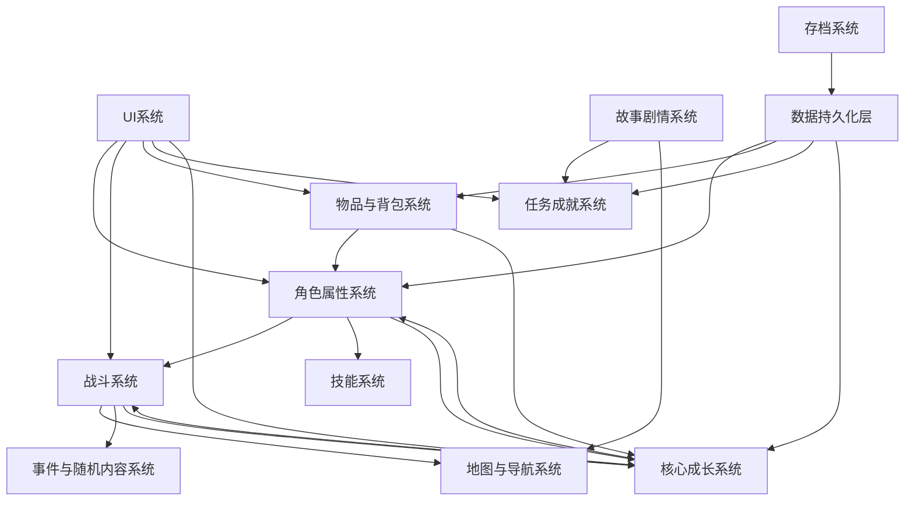
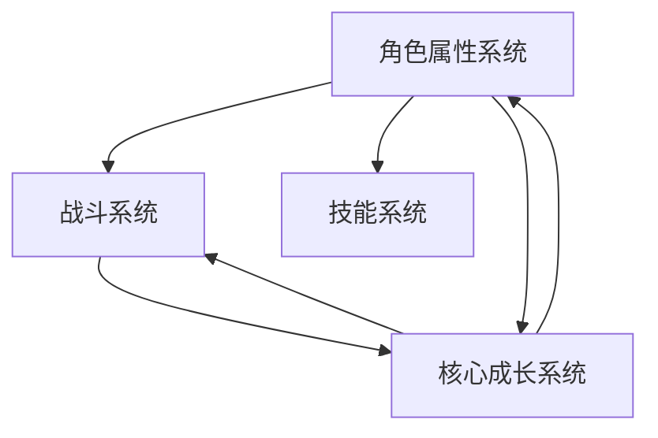
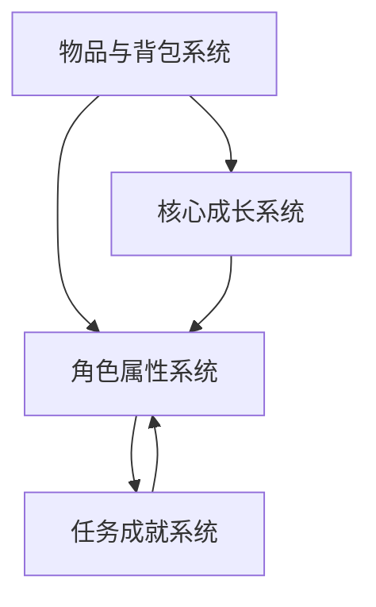
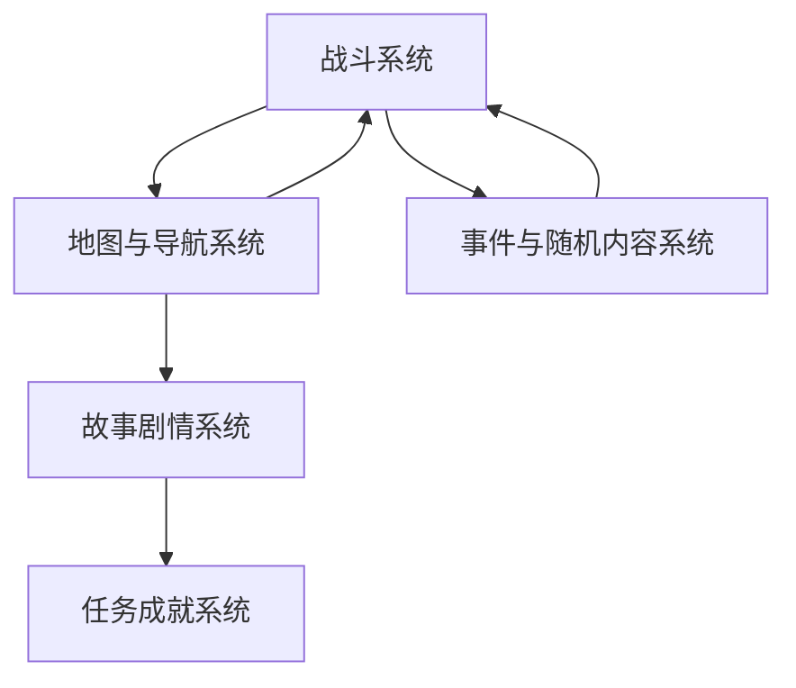
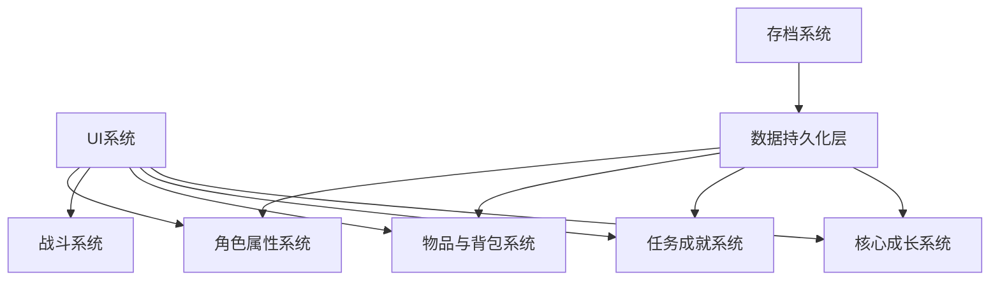

# 一期系统设计（MVP版本）

## 系统概述
本文件描述了玄幻冒险游戏一期（MVP版本）的系统设计，聚焦于实现核心玩法闭环。一期开发将优先实现8个核心模块，确保游戏可玩、稳定，并能够验证核心成长玩法的可行性。

## 模块关系图
### 整体模块关系图

为了更清晰地展示模块间的关系，我们同时提供以下几个局部关系图：

### 1. 核心玩法模块关系图

### 2. 物品与成长模块关系图

### 3. 世界与探索模块关系图

### 4. 基础设施模块关系图

## 模块功能说明

| 模块名称       | 功能项               | 描述                                                                 | 属性列                              | 方法列                              |
|--------------|---------------------|----------------------------------------------------------------------|-----------------------------------|-----------------------------------|
| **角色属性系统** | 基本属性管理         | 管理玩家角色的核心属性，包括等级、气血、法力等                       | 等级、气血、法力、攻击、防御、速度 | 获取属性值、设置属性值、计算属性成长 |
|              | 等级体系             | 实现从初级到中级的等级进阶机制，每个等级有不同的属性成长曲线         | 当前等级、等级经验、进阶条件       | 检查进阶条件、执行进阶、更新等级属性 |
|              | 经验成长机制         | 设计经验获取和升级规则，确保角色成长节奏合理                         | 总经验、当前等级经验、升级所需经验 | 添加经验、升级处理、计算经验奖励     |
|
| **战斗系统**   | 基础战斗逻辑         | 实现即时制战斗流程，大地图中进入小场景后触发即时战斗，包括角色移动、技能释放、伤害结算等 | 战斗状态、参与者列表、技能冷却     | 开始战斗、结束战斗、处理即时操作    |
|              | 简单技能系统         | 提供基础技能体系，包括普通攻击和1-2个特色技能                         | 技能列表、技能冷却、技能消耗       | 释放技能、计算技能伤害、检查技能条件 |
|              | AI行为               | 实现简单的敌人AI逻辑，如优先攻击、防御或使用技能                     | AI策略、仇恨值、行动模式           | 决定AI行动、计算目标优先级、执行AI动作 |
|
| **物品与背包系统** | 物品获取机制         | 实现通过探索、战斗、任务等方式获取物品                               | 物品掉落率、物品稀有度、获取途径   | 生成物品、添加物品到背包、计算掉落概率 |
|              | 物品使用机制         | 设计消耗品、装备等物品的使用规则和效果                               | 物品类型、使用条件、使用效果       | 使用物品、应用物品效果、检查使用条件 |
|              | 存储管理机制         | 实现背包空间管理、物品分类和整理功能                                 | 背包容量、物品列表、分类标签       | 添加物品、移除物品、整理背包        |
|
| **地图与导航系统** | 基础地图结构         | 构建1-2个简单区域地图，包含基本地形和互动元素                         | 地图数据、地形类型、区域信息       | 加载地图、生成地图、切换地图        |
|              | 简单探索机制         | 实现基本的地图探索和资源收集玩法                                     | 探索进度、已发现区域、资源点分布   | 探索区域、收集资源、更新探索状态     |
|              | 导航功能             | 提供简单的路径寻路和地图标记功能                                     | 当前位置、目标位置、路径点列表     | 计算路径、显示导航、标记位置        |
|
| **UI系统**     | 主界面               | 设计简洁的主界面，显示角色状态、小地图和快捷功能                     | 界面布局、显示元素、交互组件       | 初始化界面、更新界面数据、处理界面事件 |
|              | 战斗界面             | 提供直观的战斗操作界面，显示战斗信息和可用操作                       | 战斗信息面板、技能按钮、状态指示器 | 显示战斗信息、更新战斗状态、处理战斗输入 |
|              | 背包界面             | 设计清晰的背包界面，支持物品查看、使用和整理                         | 物品格子、分类标签、操作按钮       | 显示物品列表、处理物品操作、更新背包显示 |
|
| **核心成长系统** | 基础吸收机制         | 实现击败生物获取能力的核心玩法，设计吸收过程和规则                   | 可吸收对象、吸收成功率、吸收效果   | 执行吸收、计算吸收结果、应用吸收效果 |
|              | 能力成长系统         | 设计吸收后的能力融合和成长机制，确保角色变强的爽感                   | 能力列表、能力等级、成长潜力       | 融合能力、升级能力、激活新能力       |
|
| **存档系统**   | 基础存档功能         | 实现游戏进度的保存机制，支持手动和自动存档                           | 存档位置、存档时间、存档大小       | 创建存档、更新存档、删除存档        |
|              | 读档功能             | 实现游戏进度的加载机制，支持选择不同存档                             | 当前加载存档、加载状态、错误处理   | 加载存档、验证存档、恢复游戏状态     |
|
| **任务成就系统** | 简单主线任务         | 设计1-2条简短主线任务，引导玩家体验核心玩法                           | 任务列表、当前任务、任务进度       | 接受任务、更新任务进度、完成任务     |
|              | 基础成就             | 设计简单的成就系统，提供成就感反馈                                   | 成就列表、已完成成就、成就奖励     | 检查成就条件、解锁成就、发放成就奖励 |

## 模块关系功能说明

| 关系路径                           | 功能描述                                                                 | 传输信息                                                                 |
|----------------------------------|----------------------------------------------------------------------|----------------------------------------------------------------------|
| 角色属性系统 -> 战斗系统            | 战斗系统使用角色属性计算伤害和防御                                       | 攻击力、防御力、生命值、法力值                                           |
| 战斗系统 -> 角色属性系统            | 战斗结果影响角色属性（如受伤减少生命值）                                 | 伤害值、治疗量、状态效果                                               |
| 核心成长系统 -> 角色属性系统          | 吸收获得的能力提升角色属性                                               | 新增属性、属性增幅、特殊效果                                           |
| 物品与背包系统 -> 角色属性系统        | 使用物品或装备改变角色属性                                               | 临时属性加成、永久属性提升、状态变化                                   |
| 战斗系统 -> 物品与背包系统            | 战斗胜利获得物品奖励                                                     | 物品ID、数量、品质                                                     |
| 地图与导航系统 -> 战斗系统            | 大地图中进入小场景后触发即时战斗                                           | 敌人配置、战斗环境、初始状态                                           |
| 任务成就系统 -> 战斗系统              | 任务要求触发特定战斗                                                     | 目标敌人、战斗条件、胜利奖励                                           |
| 存档系统 -> 数据持久化层              | 存档数据写入持久化层                                                     | 角色数据、物品数据、任务数据、地图探索数据                               |
| 数据持久化层 -> 各系统                | 读档时恢复各系统状态                                                     | 角色属性、物品列表、任务进度、地图状态                                   |
| UI系统 -> 各系统                      | 用户通过UI与各系统交互                                                   | 操作指令、配置选择、确认信息                                             |

## 技术实现要点
1. 使用Godot引擎和C#语言开发，确保跨平台兼容性
2. 采用组件式设计，各系统封装为独立组件便于维护
3. 引入事件总线架构实现模块间通信，降低模块耦合度
   - 核心思想：使用中央事件总线作为中介，模块通过发布/订阅事件交互
   - 一期实现：采用简化版事件总线，支持基本的事件发布和订阅功能
4. 数据持久化使用JSON格式，确保存档文件可读性和可编辑性
5. 战斗逻辑使用状态机实现，便于扩展和修改
6. 吸收系统采用数据驱动设计，通过配置表定义不同吸收对象的效果
7. 游戏数值配置使用CSV/Excel格式，便于策划和数值设计师编辑
   - 实现方式：使用Excel设计表格，导出为CSV格式，通过工具转换为JSON供游戏使用
   - 优势：非技术人员友好、支持批量修改、易于版本控制、格式清晰直观

## 开发里程碑
1. 第1-2周：完成核心框架搭建，实现角色属性和战斗系统
2. 第3-4周：实现物品与背包系统和地图与导航系统
3. 第5-6周：完成UI系统和核心成长系统
4. 第7-8周：实现存档系统和任务成就系统
5. 第9-10周：系统集成和功能测试
6. 第11-12周：性能优化和bug修复